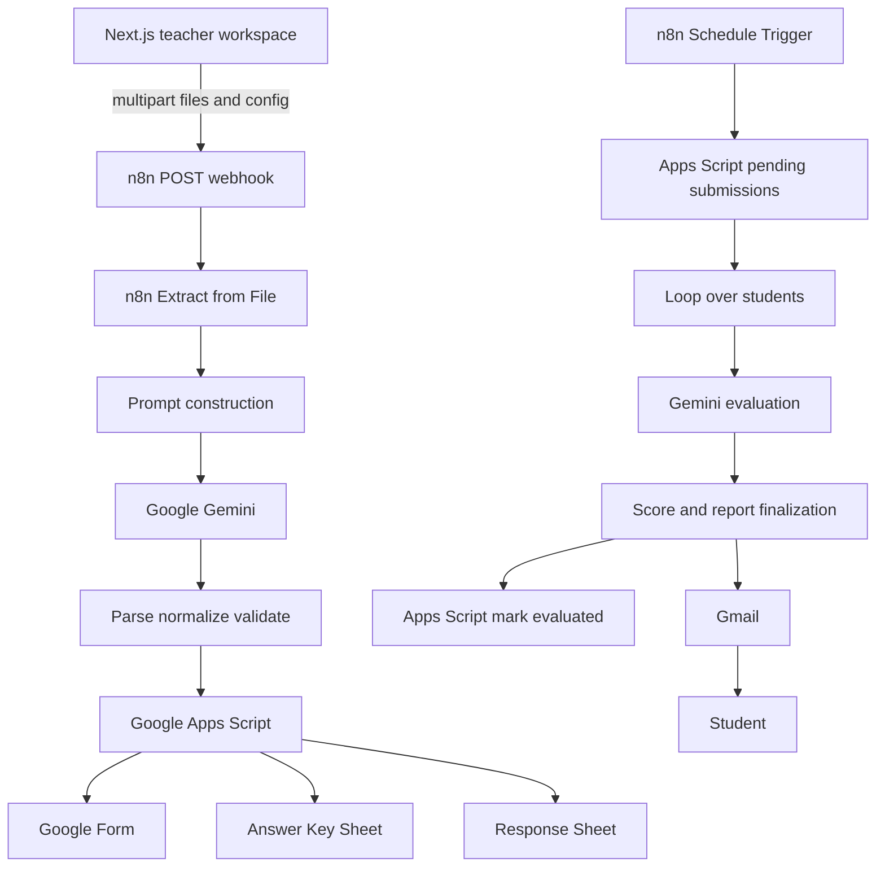

# QuizAI Studio Architecture

## 1. High-Level Architecture

QuizAI Studio has a browser-based Next.js frontend and an external n8n automation layer. The frontend collects teacher input and sends multipart form data directly to n8n. n8n performs document extraction, LLM calls, validation, Google Workspace orchestration, scheduled response processing, and Gmail delivery.

## 2. Quiz Generation Flow

1. A teacher configures question count, difficulty, question type, topic, instructions, and deadline in the workspace.
2. The browser validates file extensions and size limits and creates a `FormData` request.
3. The browser posts the request to the configured n8n webhook.
4. n8n normalizes the incoming configuration and calculates requested distributions.
5. n8n extracts text from the uploaded PDF input and aggregates the material.
6. Gemini receives the material and configuration through an assessment-generation prompt.
7. n8n parses the model response as JSON.
8. The validation node normalizes question IDs and true/false values, trims over-generation, and rejects incomplete output.
9. n8n calls Google Apps Script with the validated quiz.
10. Apps Script creates the Google Form, answer key, and response sheet and returns URLs/identifiers.
11. n8n returns a response that the frontend records in browser-local history.

The frontend accepts either an immediate artifact response or a `202` processing response with a job identifier. There is currently no durable job-status API.

## 3. Document Processing

The workflow routes each binary item by MIME type. PDF items use n8n's Extract from File PDF operation; plain-text items use its Text File operation. A Code node collects non-empty extracted text, counts readable source files, and concatenates them with source-file separators. If no readable text remains, the workflow throws an error before calling Gemini.

The canonical workflow supports PDF and `.txt` files. DOC/DOCX/PPT/PPTX are not currently supported because no Office-document conversion node or service is present in the workflow.

## 4. AI Generation

The generation agent receives a JSON representation of the quiz configuration, aggregated source material, and file count. Its system prompt requires:

- source-only factual grounding
- an exact requested question count
- requested difficulty distribution
- requested question-type distribution
- strict structures for multiple choice, true/false, and short-answer questions
- JSON-only output

A Code node strips Markdown fences when present and parses the result. The validation node checks the quiz object and `questions` array, reassigns IDs, normalizes difficulty casing and true/false values, trims excess questions, and fails when the result is too short.

These are practical prompt and validation controls, not a guarantee that generated content is factually perfect. Human review remains necessary.

## 5. Google Integration

Google Apps Script is used as the workflow's Google Workspace boundary. The n8n export sends actions and quiz data to the deployed Apps Script URL. The returned response is normalized into form, answer-key, response-sheet, and deadline fields.

The Gmail node sends the finalized HTML report to the student email address from the processed submission. OAuth credentials are configured inside n8n and intentionally removed from the checked-in export.

## 6. Student Evaluation

The scheduled branch retrieves pending submissions from Apps Script. Each submission includes student details, quiz context, and answer-level grading context such as correct answers, accepted answers, rubrics, explanations, and points.

Gemini returns graded answers and an HTML report payload. The Finalize Report Code node parses the result, calculates awarded points and percentage, classifies performance, gathers incorrect and partially correct questions, and prepares the report. A later HTTP node marks the source response as evaluated before or alongside report delivery according to the configured n8n connections.

## 7. Background Automation

A Schedule Trigger starts the pending-submission branch. It calls Apps Script to find submissions that are ready for processing, loops through returned items, evaluates each student independently, marks each response evaluated, and sends Gmail reports.

The quiz deadline is passed as configuration to the generation workflow. Deadline enforcement and response availability are ultimately handled by the Google Form/Apps Script side, not by the Next.js application.

## 8. Data Flow

### Teacher to n8n

- Uploaded files as multipart binary fields
- File count and names
- Subject and topic
- Question count
- Difficulty
- Question types
- Custom instructions
- Deadline configuration

### n8n to Gemini

- Aggregated extracted source text
- Normalized quiz configuration
- Student submission and grading context

### n8n to Google Apps Script

- `createQuiz` action with validated quiz and configuration
- `getPendingSubmissions` action
- `markEvaluated` action with response identifiers and score data

### n8n to Gmail

- Student recipient
- Quiz title
- Finalized HTML report

The browser currently retains only assessment metadata and settings in `localStorage`; it does not persist source documents or generated report contents in the Next.js database.

## 9. Current Security Model

This is a prototype security model:

- Login is not real authentication.
- Client routes are not protected.
- The browser calls a user-configured external webhook directly.
- Client-side file and configuration checks can be bypassed.
- Browser-local settings and history are not account-scoped.
- The n8n webhook and external Google services must provide their own access controls.
- The checked-in workflow contains no raw API keys, passwords, OAuth secrets, credential IDs, or live Apps Script deployment URL.

The export uses placeholders and requires credentials to be configured after import.

## 10. Future Architecture

A production-oriented design would add:

- authenticated server sessions and role-based authorization
- a Next.js server-side integration layer instead of direct browser webhook calls
- database persistence for tenants, users, assessments, jobs, submissions, and reports
- object storage for source documents with retention and access policies
- a durable queue for generation and evaluation jobs
- signed callbacks or authenticated polling for job status
- idempotency keys and retry policies for Google and n8n calls
- structured observability, audit events, and redacted error logging
- stronger validation and human review workflows for AI output
- automated tests for each transformation currently implemented in n8n Code nodes
