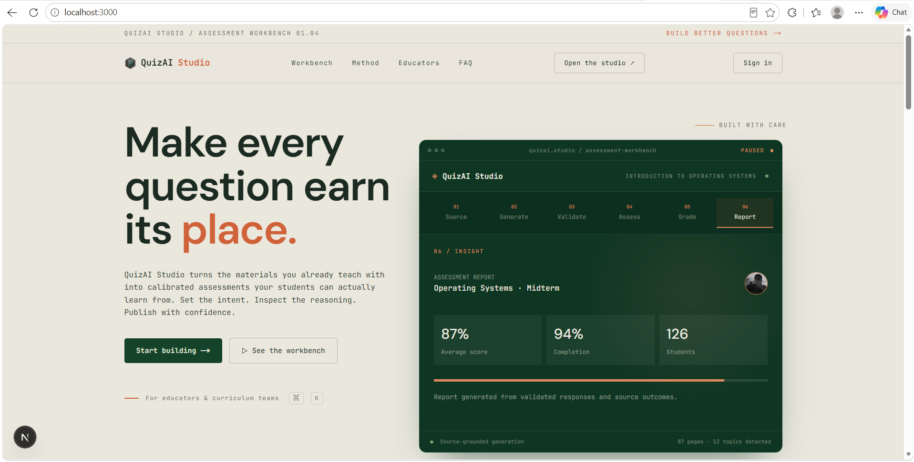
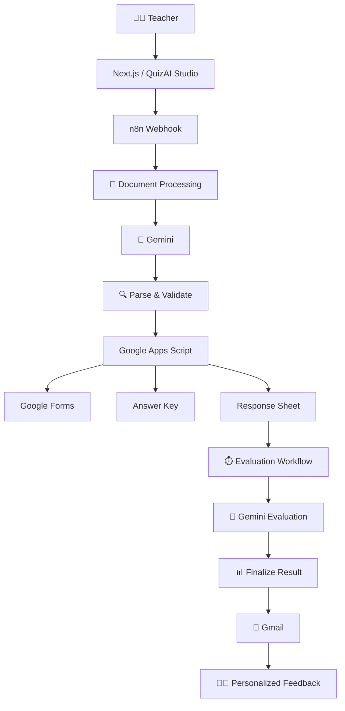
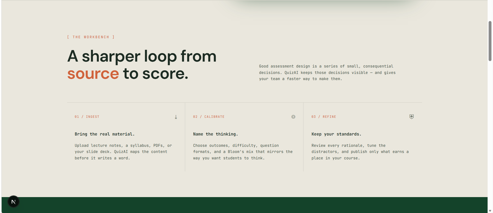
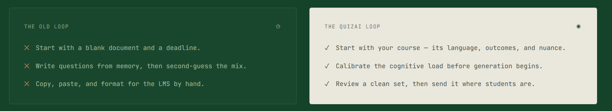

<div align="center">

# 🧠 QuizAI Studio

### Stop grading. Start teaching.

**AI-powered assessment automation from course material to personalized student feedback.**

*You set the intent. QuizAI runs the loop.*

<p>
  
  
  
  
  
  
  
</p>

<p>
  <a href="#-demo"><strong>▶️ Demo</strong></a> •
  <a href="#-quick-start">Quick Start</a> •
  <a href="#-architecture">Architecture</a> •
  <a href="#-running-the-full-demo">Run the Demo</a> •
  <a href="#-troubleshooting">Troubleshooting</a>
</p>

<br />



</div>

---

# 🎥 Demo

## ▶️ Watch QuizAI Studio in Action

<a href="https://www.youtube.com/watch?v=GTqxbrLLr8U">
  
</a>

### [▶️ Watch the Full Demo on YouTube](https://www.youtube.com/watch?v=GTqxbrLLr8U)

The demo shows the complete product flow:

```text
Course Material
      ↓
Assessment Configuration
      ↓
AI Generation
      ↓
Google Form
      ↓
Student Submission
      ↓
AI Evaluation
      ↓
Personalized Feedback
```

---

# 📌 Overview

**QuizAI Studio is a self-initiated AI engineering project — not my graduation project.**

The project explores how **LLMs, workflow automation, APIs, Google Workspace, and modern web technologies** can be combined into a complete practical product.

Instead of simply sending a prompt to an AI model and displaying its response, QuizAI Studio connects multiple systems into an end-to-end assessment pipeline:

```text
Course Material
      ↓
AI-Generated Assessment
      ↓
Validation
      ↓
Google Form
      ↓
Student Submission
      ↓
AI Evaluation
      ↓
Personalized Feedback
```

The goal is to understand the engineering challenges involved in building an AI-powered product where an LLM is one component inside a larger software system.

---

# 🎯 Problem

Creating assessments manually requires teachers to repeatedly:

1. Read course material.
2. Decide what should be assessed.
3. Write questions.
4. Prepare answer keys.
5. Create an assessment form.
6. Collect responses.
7. Grade submissions.
8. Analyze student performance.
9. Write personalized feedback.

QuizAI Studio explores how this entire loop can be automated while keeping the teacher in control of the assessment intent.

---

# ✨ Core Capabilities

## 📚 Course Material → Assessment

Teachers can upload multiple course documents and configure:

* Number of questions
* Difficulty
* Question types
* Topic
* Custom instructions
* Assessment deadline

Supported material includes:

* PDF files
* Text files
* Multiple documents per assessment

---

## 🧠 Structured AI Generation

Gemini generates a structured assessment rather than arbitrary text.

Generated data can contain:

* Question ID
* Question type
* Difficulty
* Question text
* Options
* Correct answer
* Accepted answers
* Grading rubric
* Explanation
* Points
* Source coverage

The output is parsed and validated before being sent to downstream services.

---

## 🔍 Programmatic Validation

AI output is not trusted blindly.

The validation layer checks requirements such as:

* Required fields
* Question IDs
* Question types
* Difficulty values
* MCQ options
* Correct answers
* True/False structure
* Short-answer grading information
* Question uniqueness
* Source material availability

```text
LLM
 ↓
Structured Output
 ↓
Programmatic Validation
 ↓
Automation
```

---

## 🔗 Google Workspace Automation

A deployed Google Apps Script integration acts as the boundary between n8n and Google Workspace.

The integration handles operations such as:

* Creating Google Forms
* Creating answer keys
* Creating response sheets
* Retrieving student submissions
* Updating evaluation status

---

## 📊 Automated Evaluation

After students submit the generated Google Form, the evaluation workflow can:

1. Retrieve pending submissions.
2. Load the assessment context.
3. Send the response to Gemini.
4. Evaluate the student's answers.
5. Calculate scoring information.
6. Identify incorrect or partially correct answers.
7. Generate explanations.
8. Identify strengths and improvement areas.
9. Generate personalized study recommendations.
10. Send the report through Gmail.
11. Mark the submission as evaluated.

---

# 🏗️ Architecture



## Architectural Responsibilities

| Component              | Responsibility                        |
| ---------------------- | ------------------------------------- |
| **Next.js**            | Product UI and teacher interaction    |
| **n8n**                | Workflow orchestration                |
| **Gemini**             | Assessment generation and evaluation  |
| **Validation Layer**   | Validates structured AI output        |
| **Google Apps Script** | Google Workspace integration boundary |
| **Google Forms**       | Student assessment                    |
| **Google Sheets**      | Answer keys and student responses     |
| **Gmail**              | Personalized feedback delivery        |

The frontend and automation layer are intentionally separated:

```text
Frontend
   │
   │ Webhook Request
   ▼
n8n
   │
   ├── Gemini
   ├── Validation
   ├── Google Workspace
   └── Gmail
```

---

# 🔄 System Workflow

QuizAI Studio contains two major automation paths inside the provided n8n workflow.

## Workflow 1 — Assessment Generation

```text
QuizAI Studio
      ↓
n8n Webhook
      ↓
Document Extraction
      ↓
Material Aggregation
      ↓
Gemini
      ↓
Parse Structured JSON
      ↓
Validate Quiz
      ↓
Google Apps Script
      ↓
Google Form
      ├── Answer Key
      └── Response Sheet
```

## Workflow 2 — Student Evaluation

```text
Pending Submission
      ↓
Retrieve Response
      ↓
Load Assessment Context
      ↓
Gemini Evaluation
      ↓
Calculate Result
      ↓
Generate Personalized Feedback
      ↓
Gmail
      ↓
Mark Evaluated
```

Both paths are included in the same n8n workflow file.

---

# 🛠️ Technology Stack

## Frontend

* Next.js 16
* React 19
* TypeScript
* Tailwind CSS 4

## AI

* Google Gemini
* Structured AI generation
* AI-based answer evaluation
* AI-generated personalized feedback

## Automation

* n8n
* Webhooks
* Scheduled workflows
* HTTP APIs
* Workflow branching
* Data transformation

## Google Workspace

* Google Forms
* Google Sheets
* Gmail
* Google Apps Script

## Data / Backend

* PostgreSQL scaffolding
* Drizzle
* API health-check infrastructure

---

# 📋 Prerequisites

To reproduce the complete demo, you need:

* Git
* Node.js
* npm
* GitHub account
* n8n instance
* Gemini access/credentials
* Google account
* Google services used by the workflow
* Google Apps Script access
* Gmail access for testing the feedback pipeline

> **Important:** Installing the frontend alone does not reproduce the complete system. The n8n workflow and Google integrations are required for the full end-to-end flow.

---

# 🖥️ Product Walkthrough

### 🏠 Landing Page


---

### ⚙️ Workbench



---

### 🔄 Traditional Workflow vs QuizAI



---

### 📄 Upload Course Documents


---

### 📝 Quiz Configuration


---

### ⏰ Deadline & Advanced Settings


---

### 👀 Assessment Preview


---

### 🧠 AI Generation


---

### ✅ Generation Complete


---

### 📋 Generated Google Form


---

### 🔑 Answer Key


---

### 📊 Student Responses


---

### 📧 Personalized AI Feedback


---


# 🚀 Quick Start

## 1. Clone the Repository

```bash
git clone https://github.com/Abdelrahman-Noaman/Quiz-AI-Studio.git

cd Quiz-AI-Studio
```

---

## 2. Install Dependencies

```bash
npm install
```

---

## 3. Configure Environment Variables

Create:

```text
.env.local
```

Add the variables required by your environment.

Example:

```env
NEXT_PUBLIC_N8N_WEBHOOK_URL=your_n8n_webhook_url
```

Never commit private API keys, OAuth credentials, or other secrets.

---

## 4. Run the Frontend

```bash
npm run dev
```

Open:

```text
http://localhost:3000
```

---

# ⚙️ n8n Setup

The complete n8n workflow is included in:

```text
workflows/
└── Quiz AI Studio - FINAL FIX.json
```

Import this JSON file into your n8n instance.

The imported workflow contains both:

* Assessment Generation
* Student Evaluation

---

# 🔌 Connect QuizAI Studio to n8n

Before generating a quiz, the platform must be connected to the n8n webhook.

In QuizAI Studio:

```text
Settings
   ↓
AI Engine
   ↓
Workflow / Webhook Configuration
```

Add the URL of the **Webhook node** from the imported n8n workflow.

Then:

```text
Save
 ↓
Test Connection
```

Make sure the connection succeeds before continuing.

The connection works as follows:

```text
QuizAI Studio
      │
      │ HTTP Request
      ▼
n8n Webhook
      │
      ▼
Assessment Generation Workflow
```

> **Important:** If the webhook connection is not configured correctly, the **Generate Quiz** action cannot start the automation pipeline.

---

# ▶️ Running the Full Demo

Follow these steps in order to reproduce the complete flow.

## 1. Import the n8n Workflow

Import:

```text
workflows/Quiz AI Studio - FINAL FIX.json
```

into your n8n instance.

---

## 2. Configure the Workflow

Configure the required credentials and integrations for your environment.

This may include:

* Gemini
* Google services
* Gmail
* Google Apps Script
* HTTP/API credentials

---

## 3. Connect the Platform

In QuizAI Studio:

```text
Settings
 → AI Engine
 → Webhook URL
 → Test Connection
```

Make sure the connection test succeeds.

---

## 4. Execute the Generation Workflow

Open the imported n8n workflow.

For the current development/demo setup, the generation workflow may need to be manually executed or placed in a state where it can receive the webhook request.

The sequence is:

```text
Open n8n Workflow
       ↓
Execute / Listen for Webhook
       ↓
Return to QuizAI Studio
```

---

## 5. Generate the Quiz

Return to the QuizAI Studio workspace.

Configure:

* Course material
* Question count
* Difficulty
* Question types
* Topic
* Instructions
* Deadline

Then click:

**Generate Quiz**

The request travels through:

```text
QuizAI Studio
      ↓
n8n Webhook
      ↓
Document Processing
      ↓
Gemini
      ↓
Validation
      ↓
Google Apps Script
      ↓
Google Workspace
```

---

## 6. Verify the Generated Resources

A successful generation should produce:

* Google Form
* Answer Key
* Student Response Sheet

---

## 7. Submit the Quiz as a Student

Open the generated Google Form.

Complete the assessment.

### ⚠️ Enter an Email Address

Enter an email address that you can access.

This is important because the evaluation workflow uses the submitted email address to send the personalized feedback report.

```text
Student Name:  Your Name
Student Email: your-email@example.com
Answers:       ...
```

Submit the form.

---

## 8. Run the Evaluation Workflow

After submitting the Google Form, return to n8n.

Run the evaluation portion of the workflow.

The workflow will:

```text
Find Pending Submission
        ↓
Retrieve Student Response
        ↓
Load Assessment
        ↓
Gemini Evaluation
        ↓
Calculate Result
        ↓
Generate Feedback
        ↓
Send Gmail Report
        ↓
Mark Evaluated
```

The personalized report should then arrive at the submitted email address.

---

# 📧 Personalized Feedback

The generated report can include:

* Score
* Percentage
* Correct answers
* Incorrect answers
* Explanations
* Strengths
* Areas for improvement
* Study recommendations
* Learning resources

---

# 📁 Repository Structure

```text
Quiz-AI-Studio/
│
├── app/
│   └── ...
│
├── components/
│   └── ...
│
├── public/
│   └── ...
│
├── docs/
│   └── screenshots/
│       ├── 01-landing-hero.png
│       ├── 02-workbench-method.png
│       ├── 03-old-vs-quizai-loop.png
│       ├── 04-upload-documents.png
│       ├── 05-quiz-configuration.png
│       ├── 06-deadline-advanced.png
│       ├── 07-assessment-preview.png
│       ├── 08-generating-progress.png
│       ├── 09-generation-success.png
│       ├── 10-google-form.png
│       ├── 11-answer-key.png
│       ├── 12-responses-sheet.png
│       └── 13-email-report.png
│
├── workflows/
│   └── Quiz AI Studio - FINAL FIX.json
│
├── .env.example
├── package.json
└── README.md
```

---

# 🐛 Troubleshooting

## Generate Quiz Does Nothing

Check:

1. The n8n workflow has been imported.
2. The webhook URL is correct.
3. QuizAI Studio is connected to the correct webhook.
4. **Test Connection** succeeds.
5. The generation workflow is active/listening when the request is sent.

---

## Test Connection Fails

Verify:

* The webhook URL is correct.
* The n8n instance is reachable.
* The webhook node exists.
* The workflow is configured correctly.
* No authentication or network restriction is blocking the request.

---

## Quiz Generation Fails in n8n

Inspect the failed n8n node.

Common causes include:

* Missing Gemini credentials
* Invalid API configuration
* Invalid AI output
* Validation failure
* Missing Google credentials
* Google Apps Script configuration issues
* Invalid request payload

---

## Google Form Is Not Created

Check the Google Apps Script integration.

Verify:

* The deployment is accessible.
* Required Google permissions were granted.
* The HTTP Request node points to the correct deployment.
* The request payload matches the Apps Script requirements.

Do not expose private deployment URLs, credentials, or secrets publicly.

---

## Evaluation Does Not Run

Verify:

1. A student submitted the Google Form.
2. The response exists in the response sheet.
3. The submission is pending/unprocessed.
4. The evaluation workflow is running.
5. Gemini credentials are available.
6. The workflow can access the assessment context.

---

## Email Is Not Received

Verify that the Google Form submission contains a valid email address.

Then check:

* Gmail credentials
* Gmail permissions
* Recipient address
* n8n execution logs
* Gmail node execution

Also check the recipient's spam/promotions folders.

---

# 🔐 Security

This repository is intended for development and demonstration.

Never commit:

* API keys
* OAuth credentials
* Private webhook URLs
* Service account credentials
* Google Apps Script secrets
* Personal student data
* Private deployment configuration

Use environment variables and secure credential storage.

---

# ⚠️ Current Limitations

QuizAI Studio is currently a **working development/demo build**, not a production-ready SaaS platform.

### Authentication

The current authentication experience is primarily a frontend/UI layer and should not be treated as production-grade authentication or authorization.

### Persistence

Some application state is currently handled through browser storage.

### Database

PostgreSQL and Drizzle scaffolding exists, but the complete multi-user persistence layer is still under development.

### Webhook Security

Production deployments should add:

* Authentication
* Authorization
* Rate limiting
* Request validation
* Tenant isolation

### AI Reliability

AI-generated questions and evaluations can contain errors.

Programmatic validation helps with structural correctness but does not guarantee academic correctness.

Human review remains appropriate for real educational use.

---

# 📈 Prototype Performance

During development, the complete assessment-generation flow was demonstrated in **under one minute** for the tested scenario.

This is a development observation, not a production SLA or benchmark.

Actual performance depends on:

* Document size
* Number of documents
* Gemini latency
* n8n execution time
* Google API latency
* Network conditions
* Workflow configuration

---

# 🏭 Production Considerations

A production version would require additional engineering around security, reliability, scalability, and multi-tenancy.

## 🔐 Authentication & Authorization

* Real authentication
* Protected routes
* User accounts
* Role-based access control
* Tenant isolation

## 🗄️ Persistent Data

Potential entities include:

```text
Users
Organizations
Assessments
Questions
Students
Submissions
Evaluations
Workflow Executions
```

## ⚙️ Workflow Reliability

* Retry mechanisms
* Idempotency
* Dead-letter handling
* Error recovery
* Queue-based processing
* Execution monitoring

## 🛡️ API Security

* Authenticated webhooks
* Request validation
* Rate limiting
* Secure secret management
* API access controls

## 📊 Observability

* Structured logging
* Metrics
* Error tracking
* Workflow monitoring
* AI request tracing
* API latency monitoring

## 🧠 AI Reliability

Future improvements could include:

* Stronger source grounding
* Source citations
* Question-quality checks
* More deterministic grading
* Improved short-answer evaluation
* Confidence thresholds
* Human review workflows
* Better large-document handling

---

# 🗺️ Roadmap

## SaaS Foundation

* [ ] Real authentication
* [ ] User accounts
* [ ] Protected routes
* [ ] Tenant isolation
* [ ] Persistent user data
* [ ] Role-based access

## Data Layer

* [ ] Complete PostgreSQL integration
* [ ] Assessment history
* [ ] Student records
* [ ] Persistent workflow state
* [ ] Analytics

## Automation Reliability

* [ ] Retry mechanisms
* [ ] Idempotent evaluation
* [ ] Error handling
* [ ] Webhook authentication
* [ ] Rate limiting
* [ ] Queue-based processing

## AI Improvements

* [ ] Stronger content grounding
* [ ] Better source attribution
* [ ] More deterministic grading
* [ ] Improved short-answer evaluation
* [ ] Question-quality checks
* [ ] Better context management for large documents

## Production Architecture

* [ ] Production deployment
* [ ] Secure secrets management
* [ ] Scalable workflow execution
* [ ] Observability
* [ ] Logging and monitoring
* [ ] API security layer

---

# 🧪 Engineering Lessons

Building QuizAI Studio highlighted several challenges that are easy to overlook in simple AI demos:

* AI output needs validation before entering deterministic workflows.
* External systems require explicit integration boundaries.
* Webhooks require security considerations before production.
* AI-generated scores should not automatically be treated as authoritative.
* Background workflows need idempotency to prevent duplicate actions.
* Large documents introduce context and processing constraints.
* SaaS applications require clear user-data ownership and tenant boundaries.
* External APIs introduce latency, authentication, quotas, and failure modes.

These challenges were a major part of the engineering value of the project.

---

# 💡 What This Project Demonstrates

### AI Engineering

* LLM integration
* Prompt engineering
* Structured output
* AI evaluation
* AI-generated feedback
* Validation of model output

### Software Engineering

* Next.js architecture
* React components
* TypeScript
* API integration
* Data modeling
* Separation of responsibilities

### Automation Engineering

* n8n workflow design
* Webhooks
* Scheduled workflows
* HTTP integrations
* Multi-step orchestration
* External service coordination

### Cloud & API Architecture

* Service-to-service communication
* Google Workspace integration
* Web application → automation platform communication
* External AI service integration
* Deployment-oriented architecture

The interesting part of the project is not one individual technology.

It is the **system connecting them together**.

---

# ❤️ Why I Built It

I wanted to build something beyond:

> **"Send a prompt to an LLM and display the response."**

The goal was to understand what happens when an AI model becomes one component inside a larger software system.

That meant connecting:

```text
Frontend
   +
LLM
   +
Structured Data
   +
Validation
   +
Automation
   +
Google APIs
   +
Background Processing
   +
Email
```

and turning those technologies into one coherent product workflow.

QuizAI Studio is part of my exploration of:

**AI Engineering • Software Engineering • Automation • Cloud Architecture • API-driven Systems**

---

# 👨‍💻 Author

**Abdelrahman Noaman Mohammed**

Computer & Software Engineering Student
AWS Certified Cloud Practitioner

Interested in building practical systems across:

**AI Engineering • Cloud • DevOps • Automation • Software Engineering**

<p>
  <a href="https://github.com/Abdelrahman-Noaman">GitHub</a> •
  <a href="https://www.linkedin.com/in/abdelrahman-noaman-mohammed-74b188175/">LinkedIn</a>
</p>

---

<div align="center">


### 🧠 From course material to personalized feedback.

**QuizAI Studio**

*Built as a self-initiated engineering project.*

</div>
