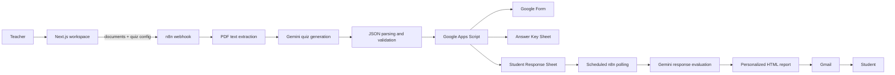

# QuizAI Studio

QuizAI Studio is an AI-powered assessment automation project that turns teacher-provided course documents into structured quizzes, creates Google Workspace assessment artifacts, evaluates student responses, and sends personalized feedback through an n8n-orchestrated workflow.

The repository is a student graduation project and prototype. The AI and automation workflow is implemented externally in n8n; the Next.js application provides the canonical teacher-facing interface.

## Overview

Creating an assessment is more than writing questions. Educators must read source material, balance difficulty and question types, create a form, prepare an answer key, monitor submissions, grade responses, and write useful feedback for each student. QuizAI Studio explores how LLMs and workflow automation can reduce that manual work while keeping the source material and configuration visible.

## Engineering Highlights

- Sends multiple educational files and structured assessment configuration to an n8n webhook.
- Uses source-grounded Gemini prompts for question generation and student evaluation.
- Requests structured JSON from the LLM and parses, normalizes, and validates quiz output in n8n.
- Enforces the configured question count and rejects incomplete generated quizzes.
- Orchestrates document extraction, AI generation, Google Workspace calls, scheduled processing, and Gmail delivery.
- Handles asynchronous generation responses with a `202 processing` status and job identifier when returned by n8n.
- Generates personalized HTML performance reports from evaluated answers.
- Includes error handling for malformed JSON, missing extracted material, invalid quiz structures, workflow failures, and request timeouts.
- Includes a dependency-free validation command for the checked-in n8n workflow export.

## Key Features

### Implemented

- Multiple document upload with client-side file count and size limits.
- Assessment configuration for question count, difficulty, question type, subject, topic, instructions, and deadline.
- Direct browser-to-n8n quiz generation request using `multipart/form-data`.
- PDF extraction in n8n.
- Gemini-based quiz generation with source-only prompt rules.
- Question normalization and count validation in n8n.
- Google Forms/Sheets creation through a Google Apps Script integration.
- Answer key and response-sheet URL handling.
- Scheduled pending-submission retrieval.
- Gemini-based grading and HTML report generation.
- Gmail delivery of student reports.
- Browser-local assessment history and settings.
- PostgreSQL connectivity health endpoint.

### Planned or Not Implemented

- Real authentication and authorization.
- Server-side request proxying and tenant isolation.
- Database-backed users, quizzes, submissions, and settings.
- Durable job status tracking and progress events.
- Object storage for uploaded documents.
- Automated tests for the n8n Code nodes.
- Functional account notifications and advanced AI settings.

## How It Works



## Architecture

The main application is the Next.js project in this repository. It does not currently contain the AI service or Google API server layer. Instead, it sends a browser request directly to a configured n8n webhook. The checked-in workflow export in [`workflows/quizai-studio.json`](workflows/quizai-studio.json) contains the automation and prompt logic required by that webhook.

The project has two workflow branches:

1. Quiz generation: receive files, extract material, generate and validate questions, then call Google Apps Script to create the assessment artifacts.
2. Student processing: run on a schedule, retrieve pending submissions, evaluate each student response, mark the response as evaluated, and send the report by Gmail.

## AI Workflow

1. n8n extracts text from uploaded PDF input.
2. A Code node aggregates extracted text and combines it with the normalized quiz configuration.
3. A Gemini agent receives a prompt that defines source-only generation rules, question counts, difficulty distribution, question-type rules, and a JSON output shape.
4. A Code node removes optional Markdown fences and parses the returned JSON.
5. The validation node checks the quiz object, normalizes IDs and true/false values, trims over-generation, and rejects too few questions.
6. A second Gemini agent receives student answers and grading context.
7. The evaluation output contains graded answers and an HTML report payload.
8. The finalization node calculates score and percentage and prepares the report for Gmail.

The workflow uses prompt instructions and runtime checks. It does not currently implement model fine-tuning, retrieval infrastructure, automated factual benchmarking, or a separate guard model.

## Automation Workflow

The n8n export includes a POST webhook and a scheduled trigger. The webhook responds with an accepted/processing response so the browser does not need to wait for every external operation. The scheduled branch asks the Google Apps Script integration for pending submissions, processes each submission through a loop, evaluates it with Gemini, marks it evaluated, and sends the report.

## Google Workspace Integration

- **Google Forms:** created by the external Google Apps Script called from n8n.
- **Google Sheets:** the workflow expects an answer key sheet and a response sheet URL/identifier from Apps Script.
- **Gmail:** the n8n Gmail node sends the generated HTML performance report to the student.
- **Google Apps Script:** acts as the integration boundary for creating quizzes, retrieving pending responses, and marking responses as evaluated.

Credential setup is intentionally excluded from the export. Configure credentials in the n8n instance after importing the workflow. See [`docs/INTEGRATIONS.md`](docs/INTEGRATIONS.md).

## Tech Stack

- **Frontend:** Next.js 16, React 19, TypeScript, Tailwind CSS
- **Application backend:** Next.js route handler for PostgreSQL health checks
- **AI:** Google Gemini through n8n LangChain nodes
- **Automation:** n8n
- **Document processing:** n8n Extract from File node
- **Database layer:** Drizzle ORM, `pg`, PostgreSQL connectivity scaffolding
- **External services:** Google Apps Script, Google Forms, Google Sheets, Gmail
- **Browser persistence:** `localStorage`
- **Validation:** TypeScript, ESLint, workflow validation script

## Project Structure

```text
src/app/                 Next.js routes and shared UI
src/app/workspace/       Canonical teacher quiz-generation interface
src/app/history/         Browser-local assessment history
src/app/settings/        Browser-local settings and webhook configuration
src/app/login/           Prototype login screen; not real authentication
src/app/api/health/      PostgreSQL connectivity health endpoint
src/app/components/      Shared shell and landing-page presentation components
src/app/lib/             Hydration-safe browser storage helper
src/db/                  Drizzle/PostgreSQL connection scaffolding
public/                  Local logo and presentation assets
workflows/               Sanitized n8n workflow export
scripts/                 Repository validation scripts
docs/                    Integration and architecture notes
```

The workspace used to create this project also contains a Vite login prototype and legacy static HTML pages. They are not the canonical implementation and are intentionally not deleted in the surrounding playground. The Next.js application in this repository is the implementation to review.

## Local Development

### Prerequisites

- Node.js compatible with the installed Next.js version.
- npm.
- Optional local PostgreSQL instance if you want to use `/api/health`.
- An n8n instance with the required community/official nodes and external Google credentials for end-to-end generation.

### Install and run

```bash
npm install
npm run dev
```

Open `http://localhost:3000` and configure the n8n webhook URL in the Settings page. The browser sends documents directly to that URL.

### Checks

```bash
npm run typecheck
npm run lint
npm run build
npm run validate:workflow
```

The health endpoint is available at `GET /api/health`. It checks PostgreSQL connectivity only; it is not an application readiness check for n8n or Google services.

## Environment Variables

Copy `.env.example` to `.env.local` for local database configuration. Never commit `.env.local` or real credentials. At present, `DATABASE_URL` is used by the database connection and health endpoint. The n8n webhook URL is currently stored in browser settings rather than a Next.js environment variable.

## n8n Setup

1. Import [`workflows/quizai-studio.json`](workflows/quizai-studio.json) into n8n.
2. Replace the three `YOUR-GOOGLE-APPS-SCRIPT-DEPLOYMENT` placeholders with the deployed Google Apps Script `/exec` URL.
3. Configure the webhook path and use its production URL in QuizAI Studio Settings.
4. Attach a Google Gemini credential to both Gemini model nodes.
5. Attach a Gmail OAuth2 credential to the Gmail node.
6. Verify the Google Apps Script accepts the actions used by the workflow: quiz creation, pending-submission retrieval, and marking a response evaluated.
7. Test the generation branch and scheduled branch separately before enabling the schedule in a shared environment.

The sanitized export intentionally has no credential IDs or secrets. n8n credentials must be selected after import.

## Current Limitations

- Authentication is a local UI gate only; any non-empty credentials are accepted.
- Routes are not protected.
- Assessment history and settings are stored in browser `localStorage`.
- The database schema is empty and no quiz data is persisted in PostgreSQL.
- Uploaded files are sent directly from the browser to the configured webhook.
- The displayed analysis progress is simulated UI feedback, not server-side progress telemetry.
- Some settings are currently UI-only and are not included in the generation payload.
- The n8n workflow and Google Apps Script must be configured externally.
- The checked-in workflow contains prompt and Code node logic but does not include the Google Apps Script source.
- No production performance, scale, reliability, or grading-accuracy claims are made.

## Future Roadmap

- Add real identity, sessions, authorization, and workspace isolation.
- Move webhook calls behind authenticated Next.js server routes.
- Add database schemas for users, assessments, jobs, submissions, and reports.
- Store documents in object storage with retention controls.
- Add durable job tracking, retries, idempotency, and observability.
- Add automated tests for request validation and n8n transformation logic.
- Make settings and notification preferences part of the actual workflow contract.

## Screenshots and Demo

No product screenshots or valid public demo link were found in the canonical application repository. Add real screenshots of the workspace, generated-artifact result, and history view before sharing the GitHub URL. Do not add fabricated screenshots or a placeholder demo link.

## GitHub Presentation

**Suggested repository description:**

> AI-powered assessment automation platform that generates quizzes, evaluates student responses, and delivers personalized feedback using LLMs and workflow automation.

**Suggested topics:** `ai`, `llm`, `ai-automation`, `education`, `edtech`, `n8n`, `google-workspace`, `assessment-automation`, `generative-ai`.
