<div align="center">

# 🧠 QuizAI Studio

### Stop grading. Start teaching.

**AI-powered assessment automation from course material to personalized student feedback.**

*You set the intent. QuizAI runs the loop.*

<p>
  
  
  
  
  
</p>

<p>
  <a href="https://www.youtube.com/watch?v=GTqxbrLLr8U"><strong>▶️ Watch Demo</strong></a> •
  <a href="#-quick-start">Quick Start</a> •
  <a href="#-architecture">Architecture</a> •
  <a href="#-product-walkthrough">Product Walkthrough</a> •
  <a href="workflows/Quiz%20AI%20Studio%20-%20FINAL%20FIX.json">n8n Workflow</a>
</p>

<br />


</div>

---

## 📌 What is QuizAI Studio?

**QuizAI Studio** is an AI-powered assessment automation platform that connects the entire assessment lifecycle into one workflow.

Instead of manually moving between documents, question banks, Google Forms, spreadsheets, grading, and student feedback, an instructor can provide the course material and assessment requirements — and QuizAI orchestrates the rest.

```text
Course Material
      ↓
Assessment Configuration
      ↓
AI Question Generation
      ↓
Validation
      ↓
Google Form + Answer Key + Response Sheet
      ↓
Student Submission
      ↓
AI Evaluation
      ↓
Personalized Feedback
      ↓
Email Delivery
```

The project combines a **Next.js application**, **Gemini**, **n8n**, and **Google Workspace automation** to demonstrate how LLMs can be integrated into a real multi-step software workflow.

> **You set the intent. QuizAI runs the loop.**

---

# 🎥 Demo

<div align="center">

<a href="https://www.youtube.com/watch?v=GTqxbrLLr8U">
  
</a>

<br /><br />

<strong>▶️ Watch the complete QuizAI Studio walkthrough</strong>

</div>

---

# 🎯 The Problem

Creating an assessment involves considerably more than writing questions.

An instructor may need to:

* Review course material
* Decide what concepts should be assessed
* Balance question difficulty
* Select question types
* Build an online form
* Prepare an answer key
* Monitor submissions
* Evaluate responses
* Identify learning gaps
* Write individualized feedback

QuizAI Studio automates this workflow.

| Traditional Process            | QuizAI Studio                      |
| ------------------------------ | ---------------------------------- |
| 📚 Review course material      | 📄 Upload course material          |
| ✍️ Write questions             | 🧠 Generate questions with Gemini  |
| ⚖️ Balance difficulty manually | 🎛️ Configure requirements         |
| 📝 Build the form              | 🤖 Generate Google Form            |
| 🗝️ Create answer key          | ⚙️ Generate answer key             |
| 👀 Monitor submissions         | 📊 Collect responses automatically |
| 📝 Grade responses             | 🧠 AI evaluates submissions        |
| 💬 Write feedback              | 💌 Generate personalized reports   |

---

# ✨ Core Capabilities

### 📄 Document-Based Assessment Generation

Upload course material and use it as the source for question generation.

### 🎛️ Configurable Assessments

Teachers can define requirements such as:

* Number of questions
* Difficulty
* Question types
* Custom instructions
* Assessment deadline

### 🧠 AI Question Generation

Gemini transforms course content and assessment requirements into structured question data.

### 📝 Automated Google Form Creation

The generated assessment is converted into a real Google Form.

### 🗝️ Automatic Answer Key

The workflow generates the corresponding answer key alongside the assessment.

### 📊 Response Collection

Student responses are collected through the generated Google Form and stored in Google Sheets.

### 🤖 AI-Powered Evaluation

Student responses are evaluated using Gemini.

### 💌 Personalized Feedback

The system generates student-specific reports containing:

* Score
* Percentage
* Correct / incorrect answers
* Strengths
* Areas for improvement
* Explanations
* Study recommendations
* Learning resources

### 📧 Automated Delivery

The completed report is delivered to the student through Gmail.

---

# 🏗️ Architecture

QuizAI Studio is composed of several cooperating layers rather than a single AI request.

```mermaid
flowchart LR

    T[👨‍🏫 Teacher]

    UI[Next.js Application]

    WH[n8n Webhook]

    DOC[📖 Document Processing]

    AI1[🧠 Gemini<br/>Question Generation]

    VAL[🧪 Output Validation]

    GAS[Google Apps Script]

    FORM[📝 Google Form]

    KEY[🗝️ Answer Key]

    SHEET[📊 Response Sheet]

    STUDENT[🎓 Student]

    PENDING[⏰ Submission Detection]

    AI2[🤖 Gemini<br/>Response Evaluation]

    REPORT[📄 Personalized Report]

    GMAIL[📧 Gmail]

    T --> UI
    UI -->|Files + Configuration| WH

    WH --> DOC
    DOC --> AI1
    AI1 --> VAL
    VAL --> GAS

    GAS --> FORM
    GAS --> KEY
    GAS --> SHEET

    FORM --> STUDENT
    STUDENT --> SHEET

    SHEET --> PENDING
    PENDING --> AI2
    AI2 --> REPORT
    REPORT --> GMAIL

    GMAIL --> STUDENT
```



---

# ⚙️ How It Works

## 1. Configure the Assessment

The teacher uploads course material and defines the assessment requirements.


Advanced options such as deadlines can also be configured.


---

## 2. Review the Assessment

Before generation, the configured assessment can be reviewed.


---

## 3. Generate With AI

The request is sent into the n8n automation pipeline.


The workflow processes the material, sends the relevant context to Gemini, validates the generated structure, and prepares the Google Workspace artifacts.


---

## 4. Generate the Assessment Infrastructure

The workflow automatically creates the assessment ecosystem.

### Google Form


### Answer Key


### Response Sheet


---

## 5. Evaluate Student Responses

Once students submit the assessment, their responses become input for the evaluation pipeline.

Gemini analyzes the submission and generates student-specific feedback.

---

## 6. Deliver Personalized Feedback

The final report is automatically delivered to the student.


---

# 🧠 Technical Highlights

QuizAI Studio was designed as more than a simple "prompt → response" AI application.

## Structured LLM Integration

LLMs generate flexible natural language, while software systems require predictable data.

QuizAI treats generated assessment data as structured information that must be validated before being passed to downstream automation.

```text
Course Content
      ↓
Gemini
      ↓
Structured Output
      ↓
Validation
      ↓
Google Workspace APIs
```

This separation makes the AI component usable as part of a larger software pipeline.

---

## 🔄 Workflow Orchestration

n8n acts as the orchestration layer connecting the individual services.

```text
Frontend
   ↓
Webhook
   ↓
Document Processing
   ↓
Gemini
   ↓
Validation
   ↓
Google Apps Script
   ↓
Google Workspace
   ↓
Student Responses
   ↓
Gemini Evaluation
   ↓
Report
   ↓
Gmail
```

---

## 🔌 Multi-Service Integration

The system integrates multiple external services:

* Gemini
* Google Forms
* Google Sheets
* Google Apps Script
* Gmail
* n8n
* Next.js

This introduces real integration concerns around:

* API payloads
* Authentication
* Data transformation
* External service responses
* Workflow state
* Error handling
* Credentials management

---

## ⏳ Asynchronous Processing

Assessment creation and student evaluation are treated as separate workflow stages.

The teacher does not need to remain connected to the system while waiting for students to submit their assessments.

The workflow can later detect pending submissions and initiate the evaluation process.

---

## 🧩 Separation of Responsibilities

The architecture intentionally separates concerns:

| Component          | Responsibility                               |
| ------------------ | -------------------------------------------- |
| Next.js            | User experience and assessment configuration |
| n8n                | Workflow orchestration                       |
| Gemini             | Generation and evaluation                    |
| Google Apps Script | Google Workspace operations                  |
| Google Forms       | Assessment delivery                          |
| Google Sheets      | Response storage                             |
| Gmail              | Feedback delivery                            |

This keeps the individual components focused on their specific responsibilities.

---

# 📊 Product Workflow

The complete system can be summarized as:

```text
┌───────────────────────────────┐
│           TEACHER             │
│                               │
│  Upload material + configure  │
│          assessment           │
└───────────────┬───────────────┘
                │
                ▼
┌───────────────────────────────┐
│         AI GENERATION         │
│                               │
│  Extract → Generate → Validate│
└───────────────┬───────────────┘
                │
                ▼
┌───────────────────────────────┐
│      GOOGLE WORKSPACE         │
│                               │
│ Form + Answer Key + Responses │
└───────────────┬───────────────┘
                │
                ▼
┌───────────────────────────────┐
│           STUDENT             │
│                               │
│       Takes assessment        │
└───────────────┬───────────────┘
                │
                ▼
┌───────────────────────────────┐
│       AI EVALUATION           │
│                               │
│ Responses → Analysis → Report │
└───────────────┬───────────────┘
                │
                ▼
┌───────────────────────────────┐
│       PERSONALIZED OUTPUT     │
│                               │
│       📧 Student Report       │
└───────────────────────────────┘
```

---

# 📸 Product Walkthrough

The repository includes a complete visual walkthrough of the product:

| Stage                      | Screenshot                   |
| -------------------------- | ---------------------------- |
| Landing / Product Overview | `01-landing-hero.png`        |
| Workbench / Method         | `02-workbench-method.png`    |
| Before vs. QuizAI Workflow | `03-old-vs-quizai-loop.png`  |
| Document Upload            | `04-upload-documents.png`    |
| Quiz Configuration         | `05-quiz-configuration.png`  |
| Advanced Deadline Settings | `06-deadline-advanced.png`   |
| Assessment Preview         | `07-assessment-preview.png`  |
| AI Generation Progress     | `08-generating-progress.png` |
| Generation Success         | `09-generation-success.png`  |
| Google Form                | `10-google-form.png`         |
| Answer Key                 | `11-answer-key.png`          |
| Response Sheet             | `12-responses-sheet.png`     |
| Personalized Email Report  | `13-email-report.png`        |

The screenshots are available under:

```text
docs/screenshots/
```

---

# 🛠️ Technology Stack

| Layer         | Technology               |
| ------------- | ------------------------ |
| Frontend      | **Next.js 16**           |
| Language      | **TypeScript**           |
| Styling       | **Tailwind CSS 4**       |
| AI            | **Google Gemini**        |
| Automation    | **n8n**                  |
| Forms         | **Google Forms**         |
| Data          | **Google Sheets**        |
| Integration   | **Google Apps Script**   |
| Email         | **Gmail**                |
| Communication | **Webhooks / REST APIs** |

---

# 📁 Repository Structure

```text
Quiz-AI-Studio/
│
├── src/
│   └── ...
│
├── public/
│   └── ...
│
├── docs/
│   ├── screenshots/
│   │   ├── 01-landing-hero.png
│   │   ├── 02-workbench-method.png
│   │   ├── ...
│   │   └── 13-email-report.png
│   │
│   └── INTEGRATIONS.md
│
├── scripts/
│   └── ...
│
├── workflows/
│   └── Quiz AI Studio - FINAL FIX.json
│
├── ARCHITECTURE.md
├── AGENTS.md
├── CLAUDE.md
├── .env.example
├── package.json
├── next.config.ts
└── README.md
```

---

# 🚀 Quick Start

## Prerequisites

* Node.js 20+
* npm
* Gemini API access
* n8n instance
* Google account

---

## 1. Clone the Repository

```bash
git clone https://github.com/Abdelrahman-Noaman/Quiz-AI-Studio.git

cd Quiz-AI-Studio
```

---

## 2. Install Dependencies

```bash
npm install
```

---

## 3. Configure Environment Variables

Create a local environment file:

```bash
.env.local
```

Use `.env.example` as the reference for the required configuration.

```bash
cp .env.example .env.local
```

> Never commit API keys, OAuth credentials, or other secrets.

---

## 4. Start the Development Server

```bash
npm run dev
```

Then open:

```text
http://localhost:3000
```

---

# 🔧 Full Automation Setup

The frontend can be explored locally, but the complete workflow requires the external services used by the automation pipeline.

```text
Next.js
   │
   ▼
n8n
   │
   ├── Gemini
   ├── Document Processing
   └── Google Apps Script
             │
             ├── Google Forms
             ├── Google Sheets
             └── Gmail
```

The repository includes the n8n workflow:

```text
workflows/Quiz AI Studio - FINAL FIX.json
```

Import the workflow into your n8n instance and configure the required credentials and environment-specific endpoints.

Additional integration notes are available in:

```text
docs/INTEGRATIONS.md
```

---

# 🔐 Security

No private credentials or API keys are included in this repository.

Do not commit:

* API keys
* OAuth credentials
* Google service account keys
* Private webhook URLs
* Student personal information

For a production deployment, additional controls would be required, including:

* Authentication
* Authorization
* User isolation
* Secrets management
* Rate limiting
* Input validation
* Data retention policies
* Monitoring and observability

---

# 📈 Prototype Performance

In the current prototype workflow, an assessment can be generated and prepared in **under one minute under the tested demo conditions**.

This is a prototype measurement rather than a universal performance guarantee; execution time depends on factors such as document size, number of questions, model response time, and external API latency.

The more important objective is demonstrating how multiple manual assessment steps can be connected into a single automated pipeline.

---

# 🧪 Project Status

**Status: Functional prototype / active development**

The current implementation demonstrates the complete assessment lifecycle:

```text
Teacher
   ↓
Course Material
   ↓
AI Question Generation
   ↓
Google Form
   ↓
Student Submission
   ↓
AI Evaluation
   ↓
Personalized Feedback
```

The project is being developed toward a more production-oriented SaaS architecture.

---

# 🗺️ Roadmap

### ✅ Implemented

* [x] Next.js application
* [x] Assessment configuration
* [x] Course-material upload
* [x] AI question generation
* [x] Structured question generation
* [x] n8n orchestration
* [x] Google Form generation
* [x] Answer key generation
* [x] Response collection
* [x] AI response evaluation
* [x] Personalized feedback
* [x] Automated email delivery
* [x] End-to-end workflow demonstration

### 🚧 In Progress

* [ ] Authentication
* [ ] Teacher accounts
* [ ] User-specific assessment history
* [ ] Multi-user SaaS architecture
* [ ] Improved error handling
* [ ] Production deployment
* [ ] Observability and workflow monitoring

### 🔮 Future

* [ ] Multi-tenant architecture
* [ ] Assessment analytics
* [ ] Question bank
* [ ] Student progress tracking
* [ ] LMS integrations
* [ ] Advanced teacher controls

---

# 💼 What This Project Demonstrates

QuizAI Studio demonstrates practical experience across several engineering areas.

### 🤖 AI Engineering

* LLM API integration
* Prompt engineering
* Structured AI output
* AI-based evaluation
* AI workflow design

### 💻 Software Engineering

* Next.js
* TypeScript
* API integration
* Data transformation
* Component-based UI development
* Separation of responsibilities

### ⚙️ Automation & Integration

* n8n workflow orchestration
* Webhooks
* REST APIs
* Multi-step automation
* External service integration
* Asynchronous processing

### ☁️ Cloud & Platform Concepts

* API-driven architecture
* Service integration
* External authentication
* Environment-based configuration
* Workflow orchestration

### 🧩 Product Engineering

* End-to-end product workflow
* User-centered interface
* Automation of repetitive processes
* Integration of AI into a practical application

---

# 💡 Why I Built It

<div align="center">


</div>

QuizAI Studio is a **self-initiated project** built to explore what happens when an LLM becomes one component inside a larger software system.

Instead of building another standalone chatbot, I wanted to connect:

**User Interface → AI → APIs → Automation → Data → Evaluation → Real Output**

The project gave me practical experience with the challenges that appear when AI has to interact with real applications and external services:

* Structured LLM outputs
* Document processing
* API integration
* Workflow orchestration
* Data validation
* Asynchronous processing
* Google Workspace automation
* Personalized AI-generated output

The core idea is simple:

> **AI becomes significantly more useful when it is part of a reliable workflow.**

---

# 👨‍💻 Author

**Abdelrahman Noaman**

Computer & Software Engineering Student at **Misr University for Science and Technology (MUST)**

Building at the intersection of:

**☁️ Cloud • ⚙️ DevOps • 🤖 AI • 🔄 Automation**

<p>
  <a href="https://www.linkedin.com/in/abdelrahman-noaman-mohammed-74b188175/">LinkedIn</a> •
  <a href="https://github.com/Abdelrahman-Noaman">GitHub</a>
</p>

---

<div align="center">

## 🧠 QuizAI Studio

**Turn assessment from a task into a workflow.**

⭐ If you found the project interesting, consider giving the repository a star.

</div>
