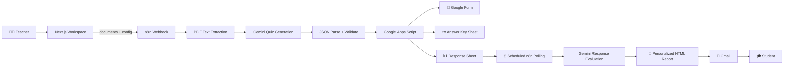

<div align="center">

# 🧠 QuizAI Studio

### AI-Powered Assessment Automation for Educators

*From course material to graded, personalized student feedback — automatically.*

<p>
  
  
  
  
</p>

<p>
  
  
  
  
</p>

<p>
  <a href="#-quick-start">Quick Start</a> •
  <a href="#-how-it-works">How It Works</a> •
  <a href="#-architecture">Architecture</a> •
  <a href="#-setup-guide">Setup Guide</a> •
  <a href="#-tech-stack">Tech Stack</a>
</p>

</div>

---

<div align="center">
  
</div>

---

## 🎯 The Problem

Creating an assessment is more than writing questions.

Educators must:

* 📚 Read and digest source material
* ⚖️ Balance difficulty and question types
* 📝 Build a form and prepare an answer key
* 👀 Monitor submissions one by one
* ✍️ Grade responses manually
* 💬 Write personalized feedback for every student

This work scales linearly with class size — but a teacher's time does not.

## 💡 The Solution

**QuizAI Studio** explores how LLMs and workflow automation can eliminate the repetitive parts of assessment design — while keeping the source material, prompts, and configuration fully visible to the teacher.

<div align="center">
  
</div>

> The teacher sets the intent. QuizAI runs the loop.

---

## ✨ Key Features

<table>
  <tr>
    <td width="50%" valign="top">

**🚀 Implemented**

* 📄 Multi-file upload (PDF + plain text)
* 🎛️ Full quiz configuration — count, difficulty, type, topic, deadline, custom instructions
* 🔗 Direct browser-to-n8n `multipart/form-data` request
* 📖 PDF & text extraction in n8n
* 🧠 Source-grounded Gemini quiz generation
* 🧪 JSON parsing, normalization & count validation
* 📝 Google Forms + Sheets via Apps Script
* 🗝️ Auto-generated answer key & response sheet
* ⏰ Scheduled pending-submission retrieval
* 🤖 Gemini-based grading with HTML report
* 📧 Personalized Gmail delivery
* 🗂️ Browser-local history & settings
* 🩺 PostgreSQL health endpoint

    </td>
    <td width="50%" valign="top">

**🛣️ Planned**

* 🔐 Real authentication & authorization
* 🛡️ Server-side request proxying
* 🗄️ Database-backed users, quizzes, submissions
* 📊 Durable job status & progress events
* ☁️ Object storage for uploaded documents
* 🧪 Automated tests for n8n Code nodes
* 🔔 Functional account notifications
* ⚙️ Advanced AI settings

    </td>
  </tr>

</table>

---

## 🎬 How It Works

A teacher uploads course material and configures a quiz. QuizAI Studio streams the request to n8n, which extracts the text, calls Gemini with source-grounded prompts, validates the JSON output, and asks Google Apps Script to create a Google Form + Answer Key + Response Sheet. When students submit, a scheduled n8n branch grades each response with Gemini and emails a personalized HTML report through Gmail.



---

## 🖼️ Product Walkthrough

<div align="center">

### 1️⃣ Upload Course Material


### 2️⃣ Configure the Assessment


### 3️⃣ Set Deadline & Advanced Options


### 4️⃣ Review & Generate


### 5️⃣ AI Generates Your Quiz


### 6️⃣ Get Your Assessment Artifacts


### 7️⃣ Students Submit via Google Form


### 8️⃣ Answer Key — Auto-Generated


### 9️⃣ Responses Collected Automatically


### 🔟 Personalized AI Report Delivered by Email


</div>

---

## 🏗️ Architecture

The Next.js app in this repository is the **canonical teacher-facing interface**. It does not host the AI or Google API layer directly — instead, it sends a browser request straight to a configured **n8n webhook**. The automation, prompt engineering, and Google integrations live inside the sanitized n8n workflow exported to [`workflows/quizai-studio.json`](workflows/quizai-studio.json).

### The Two Workflow Branches

<table>
  <tr>
    <td width="50%" valign="top">

**🟢 Branch 1 — Quiz Generation**

Triggered by the teacher via HTTP webhook:

1. Receive files + configuration
2. Extract PDF / text content
3. Aggregate + normalize prompt input
4. Generate questions with Gemini
5. Parse & validate JSON output
6. Call Google Apps Script
7. Create Form + Answer Key + Response Sheet

    </td>
    <td width="50%" valign="top">

**🔵 Branch 2 — Student Processing**

Triggered on a schedule:

1. Ask Apps Script for pending submissions
2. Loop over each submission
3. Evaluate with Gemini using source context
4. Build personalized HTML report
5. Send via Gmail
6. Mark submission as evaluated

    </td>

  </tr>
</table>

For a deeper dive, see [`docs/INTEGRATIONS.md`](docs/INTEGRATIONS.md).

---

## 🤖 AI Workflow

1. **Extract** — n8n extracts text from uploaded PDF input
2. **Aggregate** — a Code node combines extracted text with the normalized quiz configuration
3. **Generate** — a Gemini agent receives a prompt defining:

   * Source-only generation rules
   * Question counts
   * Difficulty distribution
   * Question-type rules
   * Exact JSON output shape
4. **Sanitize** — strip optional Markdown fences, parse JSON
5. **Validate** — normalize IDs and true/false values, trim over-generation, reject under-generation
6. **Evaluate** — a second Gemini agent grades student answers using the source context
7. **Report** — evaluation output contains graded answers + an HTML report payload
8. **Finalize** — score & percentage calculated, report prepared for Gmail

> The workflow uses prompt instructions + runtime checks. It does not currently implement fine-tuning, retrieval infrastructure, factual benchmarking, or a separate guard model.

---

## 🔌 Google Workspace Integration

| Service                | Role                                                                                           |
| ---------------------- | ---------------------------------------------------------------------------------------------- |
| **Google Forms**       | Created by the external Google Apps Script called from n8n                                     |
| **Google Sheets**      | Answer key + response sheet URLs returned by Apps Script                                       |
| **Gmail**              | n8n Gmail node sends the personalized HTML report to each student                              |
| **Google Apps Script** | Integration boundary — creates quizzes, retrieves pending responses, marks responses evaluated |

Credential setup is intentionally excluded from the sanitized workflow export. Configure credentials in your own n8n instance after importing.

---

## 🧰 Tech Stack

<table>
  <tr>
    <td><b>Frontend</b></td>
    <td>Next.js 16 • React 19 • TypeScript • Tailwind CSS</td>
  </tr>
  <tr>
    <td><b>App Backend</b></td>
    <td>Next.js route handler (PostgreSQL health check)</td>
  </tr>
  <tr>
    <td><b>AI</b></td>
    <td>Google Gemini via n8n LangChain nodes</td>
  </tr>
  <tr>
    <td><b>Automation</b></td>
    <td>n8n (webhook + scheduled trigger)</td>
  </tr>
  <tr>
    <td><b>Document Processing</b></td>
    <td>n8n Extract from File (PDF + Text)</td>
  </tr>
  <tr>
    <td><b>Database Layer</b></td>
    <td>Drizzle ORM • <code>pg</code> • PostgreSQL scaffolding</td>
  </tr>
  <tr>
    <td><b>External Services</b></td>
    <td>Google Apps Script • Forms • Sheets • Gmail</td>
  </tr>
  <tr>
    <td><b>Browser Persistence</b></td>
    <td><code>localStorage</code></td>
  </tr>
  <tr>
    <td><b>Validation</b></td>
    <td>TypeScript • ESLint • workflow validation script</td>
  </tr>
</table>

---

## ⚡ Quick Start

> ⚠️ **Important:** QuizAI Studio is a **composed system**. `npm run dev` alone is not enough.
> The full demo needs **Next.js + n8n + Google Apps Script + Gemini + Gmail**.
> Follow the [Setup Guide](#-setup-guide) below.

```bash
git clone https://github.com/Abdelrahman-Noaman/Quiz-AI-Studio.git
cd Quiz-AI-Studio
npm install
npm run dev
```

Then open `http://localhost:3000` and configure your n8n webhook URL in **Settings**.

---

## 📘 Setup Guide

### 1. Local Development

**Prerequisites**

* Node.js compatible with the installed Next.js version
* npm
* *(Optional)* Local PostgreSQL if you want to use `/api/health`
* An n8n instance with the required nodes and Google credentials for end-to-end generation

**Install & run**

```bash
npm install
npm run dev
```

**Checks**

```bash
npm run typecheck
npm run lint
npm run build
npm run validate:workflow
```

The health endpoint is available at `GET /api/health` — it only checks PostgreSQL connectivity (not n8n or Google service readiness).

### 2. Environment Variables

Copy `.env.example` to `.env.local` for local database config.

**Never commit `.env.local` or real credentials.**

Currently, `DATABASE_URL` is used by the database connection and health endpoint. The n8n webhook URL is stored in browser settings — not in a Next.js env var.

### 3. n8n Setup

1. Import [`workflows/quizai-studio.json`](workflows/quizai-studio.json) into n8n
2. Replace the three `YOUR-GOOGLE-APPS-SCRIPT-DEPLOYMENT` placeholders with your deployed Apps Script `/exec` URL
3. Configure the webhook path and copy its production URL into QuizAI Studio **Settings**
4. Attach a **Google Gemini** credential to both Gemini model nodes
5. Attach a **Gmail OAuth2** credential to the Gmail node
6. Verify Apps Script accepts:

   * Quiz creation
   * Pending-submission retrieval
   * Marking response evaluated
7. Test the generation branch and scheduled branch **separately** before enabling the schedule in a shared environment

> 🔒 The sanitized export intentionally has no credential IDs or secrets. n8n credentials must be selected after import.

### 4. Reproducing the Full Demo

1. Start Next.js → open the workspace
2. Import + activate the n8n workflow
3. Paste the webhook URL into **Settings** → click **Test Connection**
4. Upload course docs → configure → **Generate Quiz**
5. Open the generated Google Form → submit with a **real email address**
6. Manually execute the evaluation branch in n8n
7. Check the student email for the personalized report

---

## 📂 Project Structure

```text
src/app/                 Next.js routes and shared UI
src/app/workspace/       Canonical teacher quiz-generation interface
src/app/history/         Browser-local assessment history
src/app/settings/        Browser-local settings and webhook configuration
src/app/login/           Prototype login screen (not real authentication)
src/app/api/health/      PostgreSQL connectivity health endpoint
src/app/components/      Shared shell and landing-page components
src/app/lib/             Hydration-safe browser storage helper
src/db/                  Drizzle/PostgreSQL connection scaffolding
public/                  Local logo and presentation assets
workflows/               Sanitized n8n workflow export
scripts/                 Repository validation scripts
docs/                    Integration and architecture notes
```

> The surrounding playground also contains a Vite login prototype and legacy static HTML pages. Those are **not** the canonical implementation — the Next.js app in this repo is what should be reviewed.

---

## ⚠️ Current Limitations

Honest notes about what this prototype **is** and **is not**:

* 🔓 Authentication is a **UI gate only** — any non-empty credentials are accepted
* 🚪 Routes are **not** protected
* 💾 History and settings live in browser `localStorage`
* 🗄️ The database schema is empty — no quiz data is persisted in PostgreSQL
* 📤 Uploaded files are sent **directly from the browser** to the configured webhook
* 📊 Displayed analysis progress is **simulated UI feedback**, not server telemetry
* ⚙️ Some settings are UI-only and not included in the generation payload
* 🔧 n8n workflow and Google Apps Script must be configured **externally**
* 📜 The workflow export contains prompt + Code node logic but **not** the Apps Script source
* 🏭 No production performance, scale, reliability, or grading-accuracy claims are made

---

## 🛣️ Roadmap

* 🔐 Real identity, sessions, authorization, workspace isolation
* 🛡️ Move webhook calls behind authenticated Next.js server routes
* 🗄️ DB schemas for users, assessments, jobs, submissions, reports
* ☁️ Object storage for documents with retention controls
* 📊 Durable job tracking, retries, idempotency, observability
* 🧪 Automated tests for request validation + n8n transformation logic
* ⚙️ Make settings + notification preferences part of the actual workflow contract

---

## 🔒 Security & Privacy

* ✅ No API keys, OAuth secrets, or credentials committed to the repo
* ✅ `.env` files are gitignored; `.env.example` provided as a template
* ✅ Public n8n workflow uses placeholders (e.g. `YOUR-GOOGLE-APPS-SCRIPT-DEPLOYMENT`)
* ✅ Credential metadata stripped from the exported workflow
* ✅ Reviewers must configure their **own** integrations in their **own** n8n instance

### Common Gotcha

If you see this in n8n:

```text
getaddrinfo ENOTFOUND your-google-apps-script-deployment
```

That's **not a bug** — the placeholder is intentional. Replace it with your own deployed Apps Script `/exec` URL.

---

## 📚 Additional Docs

* 📐 [`ARCHITECTURE.md`](ARCHITECTURE.md) — architectural deep dive
* 🔌 [`docs/INTEGRATIONS.md`](docs/INTEGRATIONS.md) — Google Workspace, Gemini, and n8n details
* ⚙️ [`.env.example`](.env.example) — required environment variables

---

## 🏷️ GitHub Presentation

**Suggested repository description**

> AI-powered assessment automation platform that generates quizzes, evaluates student responses, and delivers personalized feedback using LLMs and workflow automation.

**Suggested topics**

`ai` • `llm` • `ai-automation` • `education` • `edtech` • `n8n` • `google-workspace` • `assessment-automation` • `generative-ai`

---

<div align="center">

## 🎓 About

**QuizAI Studio** is a graduation project exploring how modern LLMs and workflow automation can eliminate the repetitive parts of teaching assessment — freeing educators to focus on what matters most: their students.

Built with ❤️ using Next.js, n8n, and Google Gemini.

<sub>Made by <a href="https://github.com/Abdelrahman-Noaman">Abdelrahman Noaman</a></sub>

</div>
