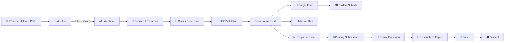

<div align="center">

# 🧠 QuizAI Studio

### Stop grading. Start teaching.

**From course material to graded, personalized student feedback — automatically.**

*You set the intent. QuizAI runs the loop.*

<p>
  
  
  
  
</p>

<p>
  <a href="https://www.youtube.com/watch?v=GTqxbrLLr8U"><strong>▶️ Watch Demo</strong></a> •
  <a href="#-try-it-in-2-minutes">Try it Locally</a> •
  <a href="#-full-power-setup-for-reviewers">Full Setup Guide</a> •
  <a href="workflows/Quiz%20AI%20Studio%20-%20FINAL%20FIX.json">n8n Workflow</a>
</p>


</div>

> **TL;DR:** Teacher uploads PDFs → AI creates a Google Form + Answer Key + Response Sheet → Students submit → AI grades, writes personalized feedback and a study plan, and emails the result.
>
> **The goal:** turn a repetitive assessment workflow into an automated pipeline.

---

## 🎥 See It in Action

<div align="center">

<a href="https://www.youtube.com/watch?v=GTqxbrLLr8U">
  
</a>

<br />

<strong>▶️ Watch the full QuizAI Studio demo</strong>

</div>

---

## 🎯 The Problem

You didn't become a teacher to spend your weekend copy-pasting questions, building Google Forms, and writing the same feedback again and again.

Creating an assessment involves much more than writing questions:

| Before QuizAI                            | After QuizAI                             |
| ---------------------------------------- | ---------------------------------------- |
| 📚 Read and digest course material       | 📄 Upload course material                |
| ⚖️ Balance difficulty and question types | 🎛️ Configure assessment requirements    |
| ✍️ Build forms and answer keys           | 🤖 AI generates the assessment           |
| 👀 Monitor student submissions           | 📊 Responses are collected automatically |
| 📝 Grade responses manually              | 🧠 AI evaluates student answers          |
| 💬 Write individual feedback             | 💌 Personalized reports are emailed      |

**QuizAI Studio automates that entire loop.**

---

## 💡 Why I Built It

<div align="center">


</div>

QuizAI Studio is a **self-initiated project** I built because I wanted to explore what it takes to turn AI capabilities into a complete, practical system.

Instead of building another simple chatbot or AI demo, I wanted to connect the entire journey:

**User interface → LLMs → APIs → workflow automation → Google Workspace → evaluation → personalized output**

The project gave me a way to work with real-world AI integration challenges such as structured LLM outputs, validation, document processing, workflow orchestration, external APIs, and multi-step automation.

> **You set the intent. QuizAI runs the loop.**

---

## ⚡ How It Works



### The loop in three steps

**1. You teach the AI**

Upload your slides, notes, PDFs, or text and configure the assessment.

**2. AI builds the assessment**

Gemini generates structured, source-grounded questions. n8n validates the response and Google Apps Script creates the Google Form, Answer Key, and Response Sheet.

**3. AI closes the loop**

When students submit, the workflow retrieves their responses, evaluates them with Gemini, calculates their score, identifies strengths and improvement areas, generates a study plan, and sends a personalized report through Gmail.

> **[!IMPORTANT]**
>
> QuizAI Studio is a **composed system**.
>
> The **Next.js application is the teacher-facing cockpit**. The AI generation, document extraction, validation, evaluation, and Google Workspace automation live primarily inside the n8n workflow:
>
> [`workflows/Quiz AI Studio - FINAL FIX.json`](workflows/Quiz%20AI%20Studio%20-%20FINAL%20FIX.json)

---

## ✨ What You'll Actually Love

### 👨‍🏫 For Teachers

* 📄 Multi-file PDF + Text upload
* 🎛️ Full assessment control:

  * Question count
  * Difficulty
  * MCQ / True-False / Short Answer / Mixed
  * Topic
  * Custom instructions
  * Deadline
* 📝 Automatic Google Form creation
* 🗝️ Automatic answer-key generation
* 📊 Automatic response-sheet creation
* 🗂️ Local assessment history and settings
* 🧠 Source-grounded AI generation
* ✅ Runtime JSON validation and question-count enforcement

### 🎓 For Students

* 📝 Familiar Google Forms experience
* 📊 Automated grading
* 💬 More than just a score
* 💡 Strengths and improvement areas
* 📖 Explanations
* 🗺️ Personalized study plan
* 📧 Individual feedback delivered by email

### 👨‍💻 For Developers

* 🔗 Browser → n8n `multipart/form-data` pipeline
* 🧠 Gemini-powered generation and evaluation
* 🧪 Sanitized, importable n8n workflow
* 🔐 No credentials committed to the repository
* 🩺 PostgreSQL health check at `/api/health`
* 🔌 Google Apps Script integration boundary
* `createQuiz`
* `getPendingSubmissions`
* `markEvaluated`

---

## 🖼️ Product Walkthrough

<details>
<summary><strong>🖼️ View the full 10-step product walkthrough</strong></summary>

### 1️⃣ Upload Course Material


### 2️⃣ Configure the Assessment


### 3️⃣ Set Deadline & Advanced Options


### 4️⃣ Review & Generate


### 5️⃣ AI Generation Progress


### 6️⃣ Get Your Assessment Artifacts


### 7️⃣ Students Submit via Google Form


### 8️⃣ Automatically Generated Answer Key


### 9️⃣ Responses Collected Automatically


### 🔟 Personalized AI Report


</details>

---

# ⚡ Try It in 2 Minutes

This starts the **Next.js frontend only** and is perfect for reviewing the UI and product experience.

```bash
git clone https://github.com/Abdelrahman-Noaman/Quiz-AI-Studio.git
cd Quiz-AI-Studio
npm install
npm run dev
```

Open:

```text
http://localhost:3000
```

Then go to:

**Settings → AI Engine**

and configure your n8n webhook URL.

> ⚠️ `npm run dev` starts the frontend only. The complete AI assessment pipeline requires the external n8n, Gemini, Google Apps Script, Google Forms, Google Sheets, and Gmail integrations described below.

---

# 🔥 Full Power Setup for Reviewers

<details>
<summary><strong>Click to expand the complete end-to-end setup</strong></summary>

## 1. Deploy the Frontend

The Next.js application can be deployed to **Netlify** or run locally.

For a reviewer:

1. Import the GitHub repository into Netlify.
2. Deploy the application.
3. Open the generated Netlify URL.

This is the teacher-facing interface.

---

## 2. Prepare n8n

Create or open an n8n workspace.

Import the sanitized workflow:

[`workflows/Quiz AI Studio - FINAL FIX.json`](workflows/Quiz%20AI%20Studio%20-%20FINAL%20FIX.json)

The public workflow intentionally contains placeholders such as:

```text
YOUR-GOOGLE-APPS-SCRIPT-DEPLOYMENT
```

These placeholders protect private deployment information and must be configured inside the reviewer's own n8n workspace.

### Configure the required integrations

* Google Gemini credentials
* Gmail OAuth2 credentials
* Google Apps Script Web App endpoint

The exported workflow does **not** contain private credential IDs or secrets.

---

## 3. Deploy Google Apps Script

The Google Apps Script backend acts as the integration boundary between n8n and Google Workspace.

Deploy it as a Web App with an `/exec` endpoint.

It should look similar to:

```text
https://script.google.com/macros/s/YOUR_DEPLOYMENT_ID/exec
```

After deployment, opening the `/exec` URL directly in a browser should return:

```json
{
  "success": true,
  "service": "Quiz AI Studio",
  "status": "online",
  "version": "2.2"
}
```

This provides a simple health check before testing the full workflow.

> 🔒 The real deployment URL is intentionally **not committed to GitHub**.

---

## 4. Configure the n8n Workflow

Inside your private n8n workspace:

1. Import the workflow.
2. Replace the Apps Script placeholders with your own `/exec` URL.
3. Configure Gemini credentials.
4. Configure Gmail OAuth2.
5. Verify the webhook configuration.
6. Save the workflow.

The workflow contains two logical branches:

**Quiz Generation**

```text
Webhook
→ Document Extraction
→ Normalize Configuration
→ Gemini
→ Parse + Validate
→ Apps Script
→ Google Form + Answer Key + Response Sheet
```

**Student Processing**

```text
Pending Submissions
→ Gemini Evaluation
→ Score + Feedback
→ HTML Report
→ Gmail
→ Mark Evaluated
```

---

## 5. Connect QuizAI Studio

Open:

**Settings → AI Engine**

Paste the n8n webhook URL.

Click:

**Test Connection**

The connection should succeed before generating an assessment.

---

## 6. Generate the Quiz

Go to the workspace.

1. Upload course material.
2. Configure the assessment.
3. Review the configuration.
4. Click **Generate Quiz**.

The complete generation path is:

```text
Next.js
   ↓
n8n Webhook
   ↓
Document Extraction
   ↓
Gemini
   ↓
JSON Parsing + Validation
   ↓
Google Apps Script
   ↓
Google Form
   ↓
Answer Key
   ↓
Response Sheet
```

---

## 7. Submit as a Student

Open the generated Google Form.

Submit the assessment.

### Important

Use a **real email address** during the submission.

The email is used to deliver the personalized evaluation report.

---

## 8. Run Student Evaluation

Return to n8n and execute the student-processing/evaluation branch.

The workflow retrieves pending submissions and evaluates them using Gemini.

It then:

* Calculates score
* Calculates percentage
* Identifies strengths
* Identifies improvement areas
* Generates explanations
* Creates a study plan
* Builds the HTML report
* Sends the report through Gmail
* Marks the submission as evaluated

---

## 9. Verify the Result

A successful end-to-end run produces:

* ✅ Google Form
* ✅ Answer Key
* ✅ Response Sheet
* ✅ Evaluated student submission
* ✅ Score and percentage
* ✅ Personalized AI feedback
* ✅ Gmail report

### Common n8n Error

If you see:

```text
getaddrinfo ENOTFOUND your-google-apps-script-deployment
```

the public workflow is still using its intentional Apps Script placeholder.

Replace:

```text
YOUR-GOOGLE-APPS-SCRIPT-DEPLOYMENT
```

with your own deployed Apps Script `/exec` URL **inside your private n8n workspace**.

Do **not** commit the private URL to GitHub.

</details>

---

# 🤖 The AI Engineering Behind the Scenes

This isn't simply:

```text
prompt → LLM → display
```

QuizAI Studio uses a multi-stage AI processing pipeline:

```text
Extract
   ↓
Aggregate
   ↓
Generate
   ↓
Sanitize
   ↓
Parse
   ↓
Validate
   ↓
Evaluate
   ↓
Report
   ↓
Finalize
```

### 1. Extract

n8n extracts content from uploaded PDF and text files.

### 2. Aggregate

A Code node combines the extracted source content with the normalized assessment configuration.

### 3. Generate

Gemini receives structured instructions covering:

* Source-only generation rules
* Question count
* Difficulty
* Question types
* Assessment instructions
* Required JSON structure

### 4. Sanitize

Optional Markdown fences and formatting artifacts are removed before parsing.

### 5. Parse

The generated response is parsed into structured JSON.

### 6. Validate

Runtime validation handles:

* Question IDs
* True/false normalization
* Question structure
* Question-count enforcement
* Over-generation trimming
* Under-generation rejection

### 7. Evaluate

A second Gemini stage evaluates student responses using the available source context and answer key.

### 8. Report

The evaluation produces structured feedback including:

* Graded answers
* Score
* Percentage
* Strengths
* Improvement areas
* Explanations
* Study recommendations
* HTML report content

### 9. Finalize

The report is prepared for Gmail delivery and the submission is marked as evaluated.

> The current implementation uses prompt engineering and runtime validation. It does not currently implement fine-tuning, dedicated retrieval infrastructure, factual benchmarking, or a separate guard model.

---

# 🏗️ Architecture Deep Dive

<details>
<summary><strong>Expand architecture details</strong></summary>

### Core Components

| Component                 | Responsibility                                           |
| ------------------------- | -------------------------------------------------------- |
| **Next.js 16 / React 19** | Teacher-facing application                               |
| **n8n**                   | Workflow orchestration, document processing, AI pipeline |
| **Google Gemini**         | Quiz generation and response evaluation                  |
| **Google Apps Script**    | Integration boundary for Google Workspace                |
| **Google Forms**          | Student assessment interface                             |
| **Google Sheets**         | Answer key and student responses                         |
| **Gmail**                 | Personalized report delivery                             |
| **PostgreSQL + Drizzle**  | Current database scaffolding / health check              |

### Branch 1 — Quiz Generation

```text
Webhook
→ Extract PDF/Text
→ Normalize Configuration
→ Gemini Generation
→ Parse JSON
→ Validate
→ Apps Script
→ Google Form
→ Answer Key
→ Response Sheet
```

### Branch 2 — Student Processing

```text
Pending Submissions
→ Gemini Evaluation
→ Score + Feedback
→ HTML Report
→ Gmail
→ Mark Evaluated
```

Full technical details:

* [`ARCHITECTURE.md`](ARCHITECTURE.md)
* [`docs/INTEGRATIONS.md`](docs/INTEGRATIONS.md)
* [`workflows/Quiz AI Studio - FINAL FIX.json`](workflows/Quiz%20AI%20Studio%20-%20FINAL%20FIX.json)

</details>

---

# 🧰 Tech Stack

| Layer                   | Technology                |
| ----------------------- | ------------------------- |
| **Frontend**            | Next.js 16                |
| **UI**                  | React 19 + Tailwind CSS 4 |
| **Language**            | TypeScript 5              |
| **AI**                  | Google Gemini             |
| **AI Orchestration**    | n8n LangChain nodes       |
| **Automation**          | n8n                       |
| **Document Processing** | n8n Extract from File     |
| **Forms**               | Google Forms              |
| **Data**                | Google Sheets             |
| **Email**               | Gmail                     |
| **Integration Backend** | Google Apps Script        |
| **Database**            | PostgreSQL                |
| **ORM**                 | Drizzle ORM               |
| **Browser Storage**     | localStorage              |

---

# 📂 Project Structure

```text
src/
├── app/
│   ├── workspace/       → Canonical teacher interface
│   ├── history/         → Browser-local assessment history
│   ├── settings/        → Webhook and AI engine settings
│   ├── login/           → Login UI prototype
│   ├── api/health/      → PostgreSQL health check
│   └── components/      → Shared UI components
│
├── db/                  → Drizzle/PostgreSQL scaffolding
│
public/                  → Logos and presentation assets

workflows/
└── Quiz AI Studio - FINAL FIX.json
                          → Sanitized n8n workflow

docs/
└── screenshots/         → Product walkthrough screenshots

scripts/
└── ...                  → Repository validation scripts
```

> The surrounding development playground may contain Vite prototypes and legacy static pages. The **Next.js application in this repository is the canonical implementation**.

---

# 🧪 Development & Validation

Install dependencies:

```bash
npm install
```

Run locally:

```bash
npm run dev
```

Run validation:

```bash
npm run typecheck
npm run lint
npm run build
npm run validate:workflow
```

The PostgreSQL health endpoint is:

```text
GET /api/health
```

It checks PostgreSQL connectivity only. It does not verify n8n or Google service readiness.

---

# 🔐 Environment Variables

Copy:

```text
.env.example
```

to:

```text
.env.local
```

and configure:

```text
DATABASE_URL
```

The n8n webhook URL is stored in browser settings rather than a Next.js environment variable.

**Never commit `.env.local` or real credentials.**

---

# ⚠️ Honest Notes

<details>
<summary><strong>Current limitations, roadmap & security</strong></summary>

### Current Limitations

QuizAI Studio is a **self-initiated project** and is currently being developed toward a more complete SaaS architecture.

* 🔓 Authentication is currently a UI gate only
* 🚪 Routes are not protected
* 💾 History and settings use browser `localStorage`
* 🗄️ PostgreSQL is currently scaffolding/health-check infrastructure
* 📤 Uploaded files are sent directly from the browser to n8n
* 📊 Progress feedback is simulated UI feedback rather than server telemetry
* ⚙️ Some settings are currently UI-only
* 🔧 n8n and Google Apps Script require external configuration
* 📜 The public repository does not contain the Apps Script source
* 🏭 No production-scale performance or grading-accuracy claims are made

### Roadmap

* 🔐 Real authentication and authorization
* 🗄️ Database-backed assessments and users
* ☁️ Object storage for uploaded documents
* 📊 Durable job tracking
* 🔄 Retries and idempotency
* 📈 Observability and monitoring
* 🔔 Functional account notifications
* 🤖 Advanced AI configuration
* 🧪 Automated AI/workflow testing

### Security

* ✅ No API keys committed
* ✅ No OAuth secrets committed
* ✅ No passwords committed
* ✅ `.env` files are gitignored
* ✅ Credential metadata is stripped from the n8n export
* ✅ Apps Script deployment URLs are replaced with placeholders
* ✅ Reviewers configure their own credentials in their own environments

</details>

---

# 📚 Documentation

* 📐 [`ARCHITECTURE.md`](ARCHITECTURE.md) — Architecture deep dive
* 🔌 [`docs/INTEGRATIONS.md`](docs/INTEGRATIONS.md) — Gemini, n8n, and Google Workspace integration
* ⚙️ [`.env.example`](.env.example) — Environment configuration template
* 🤖 [`workflows/Quiz AI Studio - FINAL FIX.json`](workflows/Quiz%20AI%20Studio%20-%20FINAL%20FIX.json) — Sanitized n8n workflow

---

# 🏷️ GitHub Presentation

### Repository Description

> AI-powered assessment automation platform that generates quizzes, evaluates student responses, and delivers personalized feedback using LLMs and workflow automation.

### Suggested Topics

```text
ai
llm
ai-automation
education
edtech
n8n
google-workspace
assessment-automation
generative-ai
nextjs
gemini
```

---

<div align="center">

## 🚀 About

**QuizAI Studio** is a self-initiated project I built because I wanted to explore how LLMs and workflow automation could be turned into a complete, practical AI-powered product.

It combines a modern Next.js teacher interface with n8n workflow orchestration, Google Gemini, Google Apps Script, Google Forms, Google Sheets, and Gmail to demonstrate an end-to-end assessment automation pipeline.

I built it to learn by solving a real workflow end-to-end — not simply to experiment with an LLM.

<br />

Built with ❤️ by **[Abdelrahman Noaman](https://github.com/Abdelrahman-Noaman)**

<br />

⭐ **Star the repository if you like the idea!**

</div>
