<div align="center">

# 🧠 QuizAI Studio

### AI-Powered Assessment Automation for Educators

*From course material to graded, personalized student feedback — automatically.*

<p>
  
  
  
  
</p>

<p>
  
  
  
  
</p>

<p>
  <a href="#-quick-start">Quick Start</a> •
  <a href="#-how-it-works">How It Works</a> •
  <a href="#-architecture">Architecture</a> •
  <a href="#-full-demo-setup">Full Demo Setup</a> •
  <a href="#-tech-stack">Tech Stack</a>
</p>

</div>

---

## 🎥 See QuizAI Studio in Action

<div align="center">

### Product Demo

<a href="https://www.youtube.com/watch?v=GTqxbrLLr8U">
  
</a>

**▶️ [Watch the full demo on YouTube](https://www.youtube.com/watch?v=GTqxbrLLr8U)**

</div>

---

## 🎬 End-to-End Workflow

<div align="center">


</div>

> Upload course material → configure the assessment → generate the quiz → collect student responses → evaluate with AI → deliver personalized feedback.

---

## 🎯 The Problem

Creating an assessment is more than writing questions.

Educators must:

* 📚 Read and digest source material
* ⚖️ Balance difficulty and question types
* 📝 Build a form and prepare an answer key
* 👀 Monitor submissions one by one
* ✍️ Grade responses manually
* 💬 Write personalized feedback for every student

This work scales with class size — but a teacher's available time does not.

## 💡 The Solution

**QuizAI Studio** explores how LLMs and workflow automation can automate the repetitive parts of assessment design and evaluation.

The teacher provides the **source material, assessment requirements, and instructions**. QuizAI Studio handles the workflow from content extraction and question generation to response evaluation and personalized feedback.

> **The teacher sets the intent. QuizAI runs the loop.**

---

## ✨ Key Features

### 🚀 Implemented

* 📄 Multi-file course material upload
* 📚 PDF and plain-text document processing
* 🎛️ Configurable question count
* 🎚️ Difficulty configuration
* 📝 Multiple question types:

  * Multiple Choice
  * True / False
  * Short Answer
  * Mixed
* 🎯 Topic and subject configuration
* ✍️ Custom assessment instructions
* ⏰ Assessment deadline configuration
* 🔗 Direct browser-to-n8n `multipart/form-data` communication
* 🧠 Source-grounded Gemini question generation
* 🧪 Structured JSON parsing and normalization
* ✅ Runtime question-count validation
* 📝 Automatic Google Form creation
* 🗝️ Automatic answer-key generation
* 📊 Automatic response-sheet creation
* 📥 Pending-submission retrieval
* 🤖 Gemini-based student response evaluation
* 📄 Personalized HTML performance reports
* 📧 Automated Gmail delivery
* 🗂️ Browser-local assessment history
* ⚙️ Browser-local settings
* 🩺 PostgreSQL connectivity health endpoint

### 🛣️ Planned

* 🔐 Real authentication and authorization
* 🛡️ Server-side request proxying
* 🗄️ Database-backed users, assessments, submissions, and reports
* 📊 Durable job status and progress events
* ☁️ Object storage for uploaded documents
* 🧪 Automated tests for n8n Code nodes
* 🔔 Functional account notifications
* ⚙️ Advanced AI configuration
* 🔄 More robust workflow retries and failure handling
* 📈 Production-grade observability and monitoring

---

## 🎬 How It Works

QuizAI Studio is a **composed system** rather than a standalone frontend.

A teacher uploads course material and configures an assessment through the Next.js application. The browser sends the files and configuration directly to an n8n webhook.

n8n then:

1. Extracts the source material
2. Normalizes the assessment configuration
3. Sends the source context and requirements to Gemini
4. Generates structured quiz data
5. Parses and validates the AI response
6. Sends the validated questions to Google Apps Script
7. Creates the Google Form, Answer Key, and Response Sheet

When students submit the generated Google Form, the second automation branch retrieves pending submissions and sends them to Gemini for evaluation.

The workflow then:

1. Evaluates each student's responses
2. Calculates the score and percentage
3. Identifies strengths and improvement areas
4. Generates explanations and a study plan
5. Builds a personalized HTML report
6. Sends the report through Gmail
7. Marks the submission as evaluated

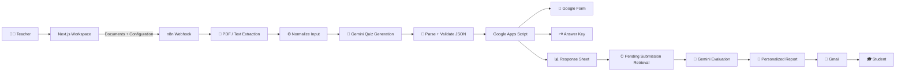

---

## 🖼️ Product Walkthrough

### 1️⃣ Upload Course Material

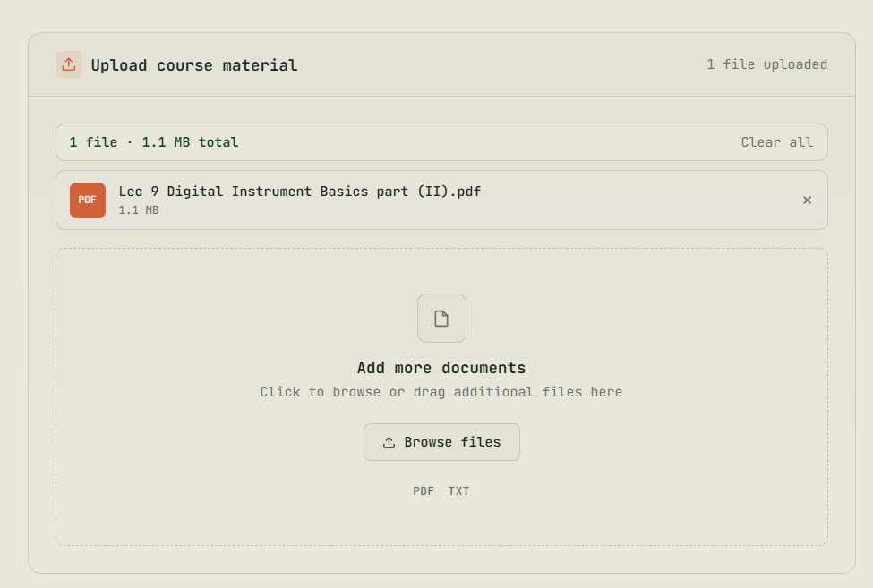

### 2️⃣ Configure the Assessment

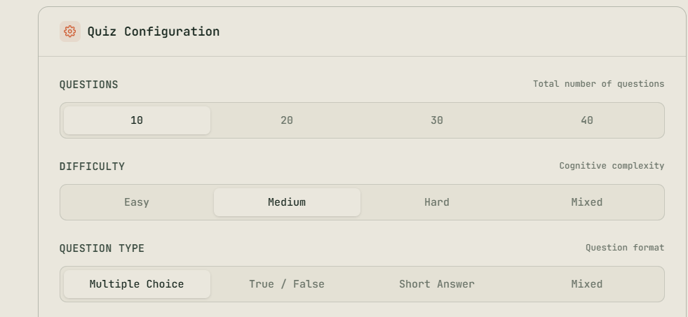

### 3️⃣ Set Deadline & Advanced Options

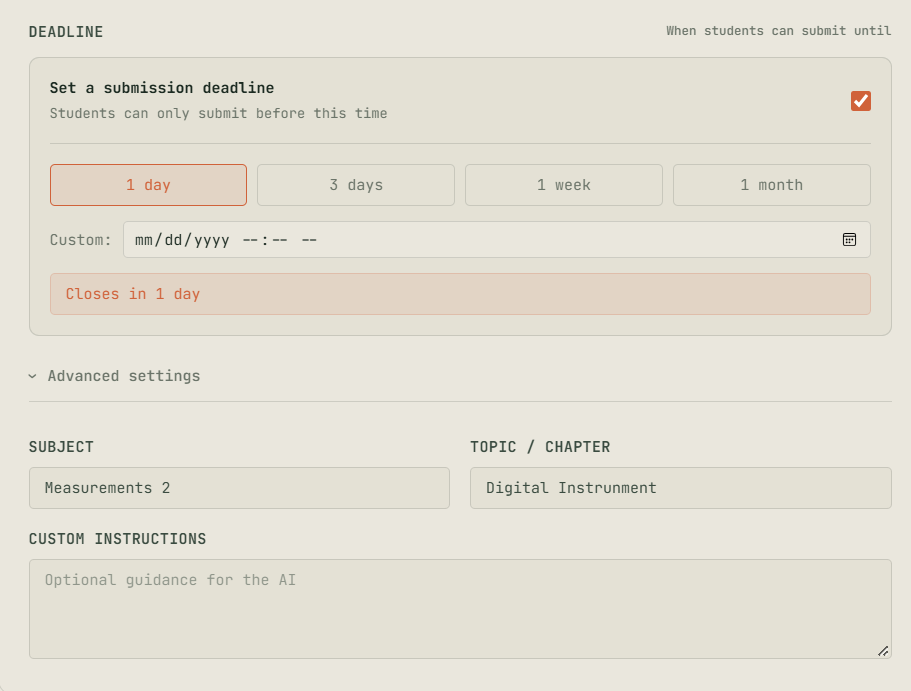

### 4️⃣ Review & Generate

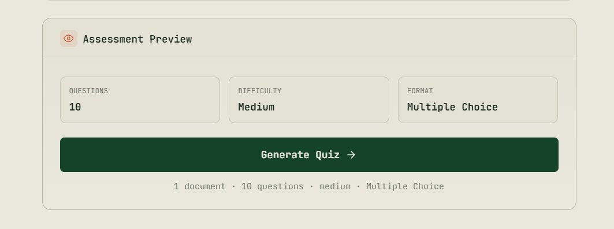

### 5️⃣ AI Generates Your Quiz

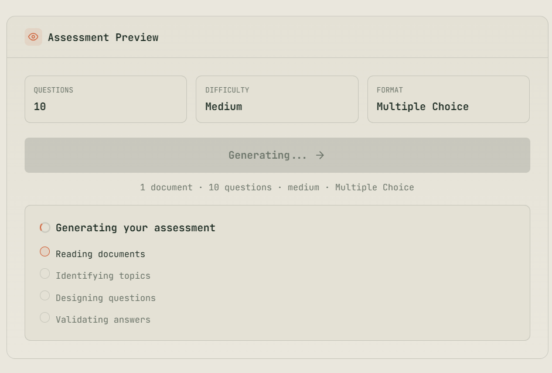

### 6️⃣ Get Your Assessment Artifacts

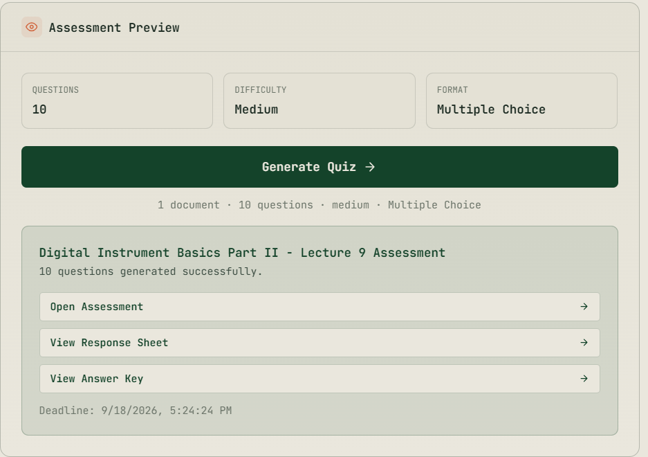

### 7️⃣ Students Submit via Google Form

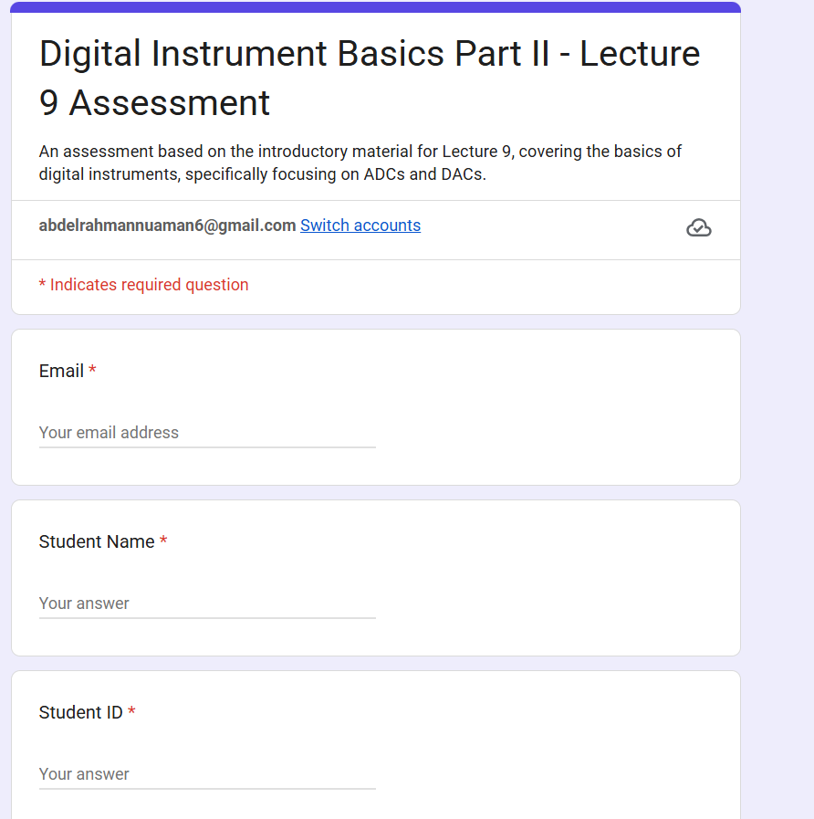

### 8️⃣ Answer Key — Auto-Generated

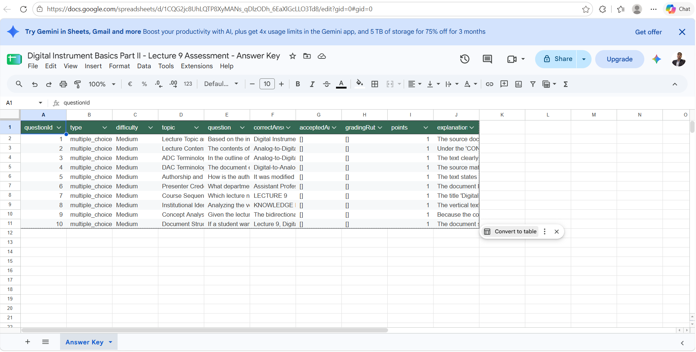

### 9️⃣ Responses Collected Automatically

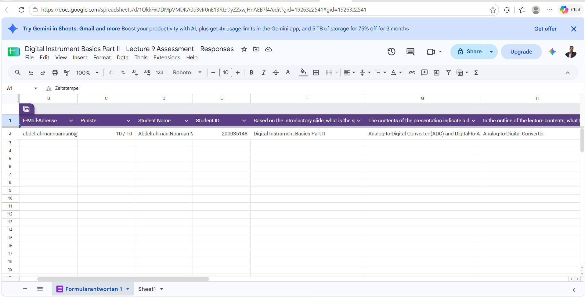

### 🔟 Personalized AI Report Delivered by Email

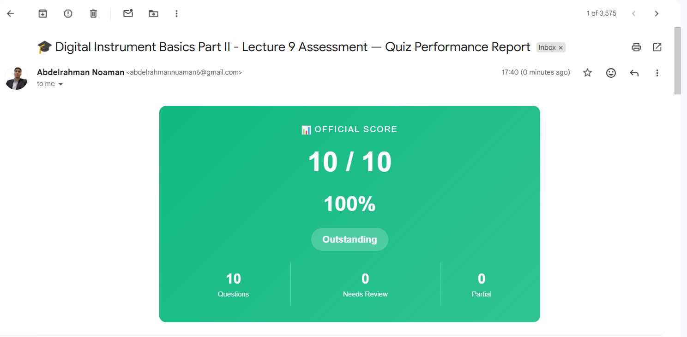

---

## 🏗️ Architecture

The **Next.js application in this repository is the canonical teacher-facing interface**.

It does not directly host the AI generation or Google Workspace automation layer. Instead, the browser communicates with a configured **n8n webhook**.

The automation, prompt engineering, AI processing, validation, and Google integrations are implemented in the n8n workflow exported to:

[`workflows/quizai-studio.json`](workflows/quizai-studio.json)

The Google Apps Script backend acts as the integration boundary between n8n and Google Workspace.

### System Components

| Component              | Responsibility                                  |
| ---------------------- | ----------------------------------------------- |
| **Next.js**            | Teacher-facing SaaS interface                   |
| **n8n**                | Workflow orchestration and automation           |
| **Gemini**             | Quiz generation and student-response evaluation |
| **Google Apps Script** | Google Forms/Sheets integration boundary        |
| **Google Forms**       | Student assessment interface                    |
| **Google Sheets**      | Answer key and response storage                 |
| **Gmail**              | Personalized report delivery                    |
| **PostgreSQL**         | Current health-check/database scaffolding       |

---

## 🔄 The Two Workflow Branches

### 🟢 Branch 1 — Quiz Generation

**Trigger:** Teacher submits an assessment through the web application.

1. Receive files and quiz configuration
2. Extract PDF/text content
3. Aggregate and normalize the input
4. Generate questions with Gemini
5. Parse the structured response
6. Normalize and validate the questions
7. Call Google Apps Script
8. Create Google Form
9. Create Answer Key
10. Create Response Sheet
11. Return generated artifact links to the application

### 🔵 Branch 2 — Student Processing

**Trigger:** Scheduled/pending-submission processing.

1. Ask Apps Script for pending submissions
2. Retrieve student answers and source context
3. Process each submission
4. Evaluate responses with Gemini
5. Calculate score and percentage
6. Generate personalized HTML feedback
7. Send the report through Gmail
8. Mark the submission as evaluated

For more details, see [`docs/INTEGRATIONS.md`](docs/INTEGRATIONS.md).

---

## 🤖 AI Engineering

QuizAI Studio is not simply sending a question to an LLM and displaying the response.

The AI workflow includes multiple processing and validation stages.

### 1. Extract

n8n extracts text from uploaded PDF and text files.

### 2. Aggregate

A Code node combines the extracted source content with the normalized assessment configuration.

### 3. Generate

Gemini receives structured instructions defining:

* Source-only generation rules
* Requested question count
* Difficulty requirements
* Question-type requirements
* Assessment instructions
* Expected JSON schema

### 4. Sanitize

The generated response is cleaned before parsing, including handling optional Markdown code fences.

### 5. Parse

The workflow parses the model response into structured JSON.

### 6. Validate

Runtime checks:

* Normalize question IDs
* Normalize true/false values
* Validate question structure
* Trim over-generation
* Reject under-generation
* Enforce the configured question count

### 7. Evaluate

A second Gemini stage evaluates student responses using the available source context and answer key.

### 8. Report

The evaluation produces:

* Graded answers
* Score
* Percentage
* Strengths
* Improvement areas
* Explanations
* Study recommendations
* HTML report content

### 9. Finalize

The workflow prepares the final report and sends it through Gmail.

> The current implementation uses prompt engineering and runtime validation. It does not currently implement fine-tuning, a dedicated retrieval infrastructure, factual benchmarking, or a separate guard model.

---

## 🔌 Google Workspace Integration

| Service                | Role                                                                                       |
| ---------------------- | ------------------------------------------------------------------------------------------ |
| **Google Forms**       | Student-facing assessment created by Apps Script                                           |
| **Google Sheets**      | Stores answer keys and student responses                                                   |
| **Gmail**              | Delivers personalized AI-generated reports                                                 |
| **Google Apps Script** | Integration boundary for creating quizzes, retrieving submissions, and marking evaluations |

The Apps Script backend supports the core integration operations required by the workflow:

* `createQuiz`
* `getPendingSubmissions`
* `markEvaluated`

Credential configuration is intentionally excluded from the public workflow export.

Each reviewer configures their own Google credentials and integrations in their own environment.

---

## 🧰 Tech Stack

| Layer                    | Technology                              |
| ------------------------ | --------------------------------------- |
| **Frontend**             | Next.js 16, React 19, TypeScript        |
| **UI**                   | Tailwind CSS                            |
| **AI**                   | Google Gemini                           |
| **AI Orchestration**     | n8n LangChain nodes                     |
| **Automation**           | n8n Webhook + scheduled processing      |
| **Document Processing**  | n8n Extract from File                   |
| **Forms**                | Google Forms                            |
| **Data / Artifacts**     | Google Sheets                           |
| **Email**                | Gmail                                   |
| **Integration Backend**  | Google Apps Script                      |
| **Database Scaffolding** | PostgreSQL + Drizzle ORM                |
| **Browser Persistence**  | localStorage                            |
| **Validation**           | TypeScript, ESLint, workflow validation |

---

# ⚡ Quick Start

> ⚠️ **Important:** QuizAI Studio is a **composed system**.
>
> Running `npm run dev` starts only the Next.js application. The complete end-to-end demo requires **Next.js + n8n + Google Apps Script + Gemini + Google Workspace**.
>
> For the complete reviewer setup, follow the **Full Demo Setup** section below.

```bash
git clone https://github.com/Abdelrahman-Noaman/Quiz-AI-Studio.git
cd Quiz-AI-Studio
npm install
npm run dev
```

The local application will be available at:

```text
http://localhost:3000
```

You can then configure the n8n webhook URL from:

**Settings → AI Engine**

---

# 🚀 Full Demo Setup

This section describes the complete setup required to reproduce the end-to-end system.

## 1. Deploy the Next.js Application

The frontend can be deployed using **Netlify**.

1. Open Netlify
2. Sign in or create an account
3. Import the GitHub repository
4. Select `Quiz-AI-Studio`
5. Deploy the application
6. Open the generated Netlify URL

The deployed application is the teacher-facing interface used for the demo.

> You can also run the frontend locally with `npm run dev`.

---

## 2. Prepare n8n

Create or open your n8n workspace.

Import the sanitized workflow:

[`workflows/quizai-studio.json`](workflows/quizai-studio.json)

The public workflow contains placeholders instead of private Google Apps Script deployment URLs.

For example:

```text
YOUR-GOOGLE-APPS-SCRIPT-DEPLOYMENT
```

These placeholders must be replaced **inside your own n8n workspace**.

### Required n8n integrations

Configure:

* Google Gemini credentials
* Gmail OAuth2 credentials
* Google Apps Script Web App endpoint

The exported workflow intentionally does **not** contain private credential IDs or secrets.

---

## 3. Configure Google Apps Script

Deploy the provided Google Apps Script backend as a Web App.

The deployment should expose an `/exec` endpoint similar to:

```text
https://script.google.com/macros/s/YOUR_DEPLOYMENT_ID/exec
```

Configure the Web App so that the n8n workflow can call it.

### Health Check

Opening the deployed `/exec` URL in a browser should return a response similar to:

```json
{
  "success": true,
  "service": "Quiz AI Studio",
  "status": "online",
  "version": "2.2"
}
```

This is useful for verifying the Apps Script deployment before testing the n8n workflow.

> 🔒 The actual deployment URL is intentionally not committed to this repository.

---

## 4. Configure the n8n Webhook

After importing the workflow:

1. Configure the webhook node
2. Configure the required credentials
3. Replace the Apps Script placeholders
4. Save the workflow
5. Copy the n8n webhook URL

Then open QuizAI Studio:

**Settings → AI Engine**

Paste the webhook URL and click:

**Test Connection**

The connection should succeed before attempting quiz generation.

---

## 5. Generate an Assessment

From the QuizAI Studio workspace:

1. Upload course material
2. Select the number of questions
3. Select difficulty
4. Select question type
5. Enter the subject/topic
6. Add custom instructions if needed
7. Configure the deadline
8. Review the assessment
9. Click **Generate Quiz**

The request follows this path:

```text
QuizAI Studio
      ↓
n8n Webhook
      ↓
Document Extraction
      ↓
Gemini
      ↓
JSON Parsing + Validation
      ↓
Google Apps Script
      ↓
Google Form + Answer Key + Response Sheet
```

---

## 6. Submit the Student Assessment

Open the generated Google Form.

Submit the assessment as a student.

**Use a real email address** during the submission because the email is required for personalized report delivery.

The response is stored in the generated Google Response Sheet.

---

## 7. Run Student Evaluation

Return to n8n and execute the student-processing/evaluation branch.

The workflow:

```text
Pending Responses
      ↓
Gemini Evaluation
      ↓
Score + Percentage
      ↓
Personalized Feedback
      ↓
HTML Report
      ↓
Gmail
      ↓
Student Email
```

The student receives a personalized report containing their performance and feedback.

---

## 8. Verify the Result

A successful end-to-end run produces:

* ✅ Google Form
* ✅ Answer Key
* ✅ Response Sheet
* ✅ Evaluated student submission
* ✅ Score and percentage
* ✅ Personalized AI feedback
* ✅ Gmail report

---

## 🧪 Local Development & Validation

### Prerequisites

* Node.js compatible with the installed Next.js version
* npm
* Optional PostgreSQL instance for `/api/health`
* n8n instance for end-to-end functionality
* Google Gemini credentials
* Google Workspace credentials

### Install

```bash
npm install
```

### Run

```bash
npm run dev
```

### Validation

```bash
npm run typecheck
npm run lint
npm run build
npm run validate:workflow
```

The health endpoint is:

```text
GET /api/health
```

It checks PostgreSQL connectivity only. It does not verify n8n or Google service readiness.

---

## 🔐 Environment Variables

Copy:

```text
.env.example
```

to:

```text
.env.local
```

for local database configuration.

**Never commit `.env.local` or real credentials.**

Currently, `DATABASE_URL` is used by the database connection and health endpoint.

The n8n webhook URL is stored in browser settings rather than a Next.js environment variable.

---

## 📂 Project Structure

```text
src/app/                 Next.js routes and shared UI
src/app/workspace/       Canonical teacher quiz-generation interface
src/app/history/         Browser-local assessment history
src/app/settings/        Browser-local settings and webhook configuration
src/app/login/           Prototype login screen
src/app/api/health/      PostgreSQL connectivity health endpoint
src/app/components/      Shared shell and landing-page components
src/app/lib/             Hydration-safe browser storage helper

src/db/                  Drizzle/PostgreSQL connection scaffolding

public/                  Local logo and presentation assets

workflows/               Sanitized n8n workflow export
scripts/                 Repository validation scripts
docs/                    Integration and architecture documentation
```

> The surrounding development playground also contains a Vite login prototype and legacy static HTML pages. These are **not the canonical implementation**. The Next.js application in this repository is the primary implementation to review.

---

## ⚠️ Current Limitations

QuizAI Studio is currently a working prototype/graduation-project system rather than a production SaaS deployment.

The current implementation intentionally has the following limitations:

* 🔓 Authentication is a **UI gate only** — any non-empty credentials are accepted
* 🚪 Routes are **not protected**
* 💾 History and settings are stored in browser `localStorage`
* 🗄️ PostgreSQL is currently scaffolding/health-check infrastructure; quiz data is not persisted there
* 📤 Uploaded files are sent directly from the browser to the configured n8n webhook
* 📊 Displayed analysis progress is simulated UI feedback rather than server telemetry
* ⚙️ Some settings are UI-only and are not included in the generation payload
* 🔧 n8n and Google Apps Script must be configured externally
* 📜 The public workflow export contains the n8n prompt and Code node logic, but not the Apps Script source
* 🏭 No production performance, scale, reliability, or grading-accuracy claims are made

These limitations are part of the planned evolution toward a production SaaS architecture.

---

## 🛣️ Roadmap

### 🔐 Platform

* Real authentication
* Sessions and authorization
* Workspace isolation
* Protected application routes

### 🗄️ Data

* Users
* Assessments
* Submissions
* Reports
* Persistent job state

### ☁️ Infrastructure

* Object storage for documents
* Durable background jobs
* Retries and idempotency
* Observability and monitoring

### 🤖 AI

* Advanced AI configuration
* Automated evaluation testing
* Better prompt/version management
* Expanded validation and quality measurement

### 🔔 Product

* Functional account notifications
* Persistent assessment status
* Real-time job progress
* Improved teacher analytics

---

## 🔒 Security & Privacy

The public repository is intentionally sanitized.

* ✅ No API keys committed
* ✅ No OAuth secrets committed
* ✅ No passwords committed
* ✅ `.env` files are gitignored
* ✅ `.env.example` is provided
* ✅ n8n credential metadata is stripped
* ✅ Google Apps Script deployment URLs are replaced with placeholders
* ✅ Reviewers configure their own integrations in their own environments

### Common n8n Error

If you see:

```text
getaddrinfo ENOTFOUND your-google-apps-script-deployment
```

the public workflow is still using its intentional placeholder.

Replace:

```text
YOUR-GOOGLE-APPS-SCRIPT-DEPLOYMENT
```

with your own deployed Google Apps Script `/exec` URL **inside your private n8n workspace**.

Do not commit the private deployment URL back to the public repository.

---

## 📚 Documentation

* 📐 [`ARCHITECTURE.md`](ARCHITECTURE.md) — architectural deep dive
* 🔌 [`docs/INTEGRATIONS.md`](docs/INTEGRATIONS.md) — Google Workspace, Gemini, and n8n integration details
* ⚙️ [`.env.example`](.env.example) — environment configuration template
* 🤖 [`workflows/quizai-studio.json`](workflows/quizai-studio.json) — sanitized n8n workflow

---

## 🏷️ GitHub Presentation

### Repository Description

> AI-powered assessment automation platform that generates quizzes, evaluates student responses, and delivers personalized feedback using LLMs and workflow automation.

### Suggested Topics

```text
ai
llm
ai-automation
education
edtech
n8n
google-workspace
assessment-automation
generative-ai
nextjs
gemini
```

---

<div align="center">

## 🎓 About

**QuizAI Studio** is a graduation project exploring how modern LLMs and workflow automation can automate the repetitive parts of assessment creation and evaluation.

The project combines a modern Next.js interface with n8n workflow orchestration, Google Gemini, Google Apps Script, Google Forms, Google Sheets, and Gmail to demonstrate an end-to-end AI-powered assessment pipeline.

Built with ❤️ using **Next.js, n8n, and Google Gemini**.

<br />

**Made by [Abdelrahman Noaman](https://github.com/Abdelrahman-Noaman)**

</div>
